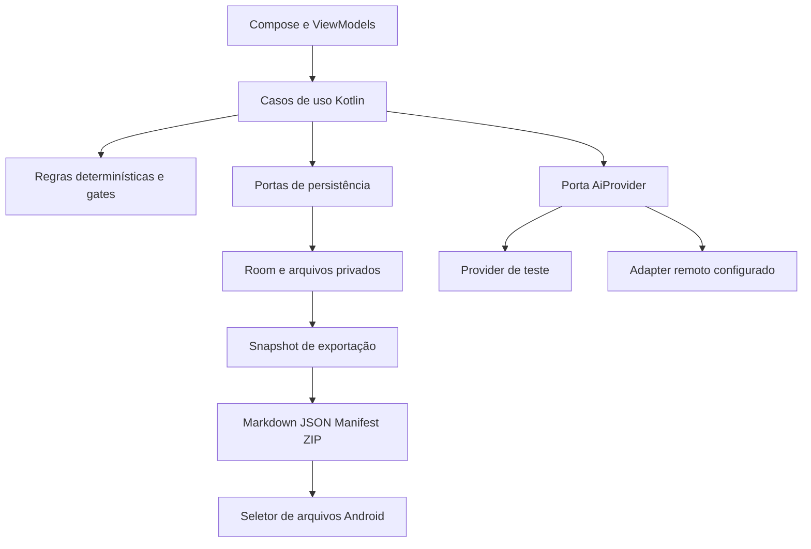

# Roadmap detalhado do Idea → MVP

Versão canônica vigente: 0.6. Data: 13 de setembro de 2026.

Este documento organiza a construção do aplicativo que transforma ideias incompletas em pacotes de especificação coerentes e verificáveis. A recomendação é entregar primeiro um núcleo Android local-first com entrevista, decisões, requisitos, recorte de MVP, roadmap e exportação. Pesquisa automática, compilação de contexto, revisão independente e bootstrap entram em incrementos posteriores.

Este roadmap é o contrato canônico vigente do projeto. D01–D09 estão aprovadas/`LOCKED`; demais parâmetros marcados como propostos continuam sujeitos à validação da fase correspondente e não viram decisão humana por inferência. Nenhuma implementação Android foi iniciada. `Idea_MVP_Master_Spec_Roadmap_v2_Pesquisa.docx` é fonte histórica/original de pesquisa, não autoridade operacional. Os oito projetos de referência estão consolidados em `REFERENCE_MATRIX.md`; licença/proveniência para eventual reuso de código permanece pendente até existir um componente concreto a reutilizar. Esta revisão também formaliza a separação **Idea Core / Idea Factory**, o gate obrigatório de valor em G10, o protocolo **Antigravity = Builder / Codex = Auditor**, Progressive Commitment, `rationale` rastreável e referências GitHub explícitas e o princípio de portabilidade futura Android → Desktop/Web sem ampliar o escopo do MVP 0.1.

Leitura sugerida para validar a direção: [visão Core/Factory](#14-idea-core-idea-factory-e-fronteira-de-valor), [versões e marcos](#2-versões-e-marcos-de-entrega), [parâmetros](#3-parâmetros-de-funcionamento-propostos), [fases e subetapas](#6-fases-e-subetapas-de-construção), [protocolo de execução](#102-protocolo-builder--auditor--product-authority), [referências GitHub](#13-referências-github-usadas-na-concepção) e [decisões fundamentais](#12-decisões-fundamentais-aprovadas). O documento mantém 21 fases F00–F20; subetapas e checks podem crescer conforme contratos forem aprovados, sem alterar silenciosamente o escopo.

## 1. Resultado de produto e limites

O primeiro usuário recomendado é alguém que já usa agentes de programação e precisa transformar uma ideia em um plano executável. Inicialmente, o próprio time usa o app para especificar utilitários e preparar o Projeto Vivo. Esse público está aprovado em D01 para o piloto inicial; sua adequação continua sendo hipótese de produto a medir no piloto, sem reabrir D01 automaticamente.

Exemplo concreto: a pessoa escreve “quero organizar meus projetos e saber o próximo passo”. O Idea preserva o texto, propõe uma interpretação, esclarece usuário e problema, registra decisões aprovadas, corta o escopo, cria requisitos verificáveis e exporta um pacote. Uma semana depois, a pessoa muda uma decisão: o app mostra quais requisitos e etapas precisam ser revistos, mantendo a versão anterior.

O momento de valor de 0.1 é **abrir o pacote exportado e entender o que construir, o que ficou fora e como verificar o resultado, sem reconstruir o contexto da conversa**. O momento de valor de 1.0 é um agente externo iniciar o Projeto Vivo com o pacote aprovado, sem lacunas críticas de planejamento.

O Idea termina no handoff. Execução de agentes, acompanhamento de código em produção, Mission Control e operação contínua pertencem ao Projeto Vivo ou a ferramentas externas. O roadmap gerado para um projeto é um produto do Idea; não deve ser confundido com este roadmap de construção do próprio Idea.

### 1.1 Princípios operacionais

- Preservar intenção original; interpretação da IA é outra entidade.
- Tornar visíveis decisões humanas, sugestões de IA, hipóteses e evidências externas.
- Permitir editar, salvar, consultar e exportar offline; geração remota depende de conexão.
- Usar regras determinísticas para IDs, locks, dependências, integridade e gates.
- Fazer a profundidade crescer com risco e complexidade, sem prometer recursos ainda não implementados.
- Medir redução de ambiguidade e retrabalho; volume de documentos não é métrica de sucesso.
- Toda fase entrega uma capacidade demonstrável. Toda fase futura permanece sujeita aos resultados do piloto.

### 1.2 Exclusões mantidas em 0.1

Execução de Codex/Claude/outros agentes; Git remoto; criação automática de repositórios; pesquisa web automática; grafo spec↔código; colaboração multiusuário; sincronização de dispositivos; clientes Web/Desktop; framework multiplataforma obrigatório; backend compartilhado sem necessidade do MVP; faturamento; JIRA; Figma; voz; sandbox de código gerado; seleção automática de modelos e mutation testing obrigatório.

### 1.3 Ajustes propostos à especificação original

| Ponto | Proposta | Motivo e impacto |
|---|---|---|
| Consistency Checker na fase final | Checks estruturais desde 0.1; revisão semântica avançada depois | Impedir que o primeiro ZIP já saia com referências quebradas. |
| IA aparece só como adapter arquitetural | Criar fase própria de contrato, falhas, custo e credenciais | Sem isso, a entrevista fica dependente de comportamento indefinido. |
| Validator completo posterior | Incluir ficha manual mínima de hipótese e teste em 0.1 | Evitar especificar um MVP sem saber o que ele valida; não inclui pesquisa automática. |
| Schema genérico | Estado estruturado canônico e envelope versionado de exportação | Evitar parsing do histórico de chat e preparar restauração. |
| Escolha DEEP já no MVP | Registrar modo desejado e mostrar capacidades disponíveis | DEEP completo só será anunciado quando seus gates existirem. |
| Segurança como etapa posterior | Segurança do próprio app desde a fundação; gerador de SECURITY depois | Credenciais e dados precisam de proteção antes da primeira chamada real. |
| Bootstrap com CI para todo tipo de projeto | Começar com um perfil Android homologado e pacote genérico sem execução | Não prometer build universal de stacks que não validamos. |
| Exportação sem recuperação | Acrescentar restauração do próprio pacote estruturado | Backup útil exige preservar dados e IDs; importação de documentos arbitrários segue posterior. |

Os acréscimos de ficha de validação mínima e restauração entram na validação de escopo D04 e D06. Podem ser retirados explicitamente, com seus impactos registrados.

### 1.4 Idea Core, Idea Factory e fronteira de valor

O produto será tratado como duas camadas evolutivas, sem criar dois aplicativos:

**Idea Core** prova o valor essencial: `Capture → Clarify → Decide → Cut → Specify → Plan → Export`. Ele corresponde principalmente a F00–F10 e deve funcionar antes de qualquer expansão sofisticada.

**Idea Factory** amplia um núcleo já útil: `Research → Validate → Blueprint → Task DAG → Context Compiler → Guardrails → Independent Review → Bootstrap → Agent Handoff`. Ela corresponde a F11–F20.

**Regra constitucional G10:** nenhuma capacidade de F11–F20 entra em implementação de produto enquanto G10 não demonstrar que o núcleo reduz ambiguidade e produz pacotes úteis. Preparação documental, fixtures e pesquisa podem ocorrer antes, mas não contam como autorização para construir a Factory. Se G10 falhar, o retorno obrigatório é F06–F08 antes de adicionar pesquisa, DAG, guardrails ou bootstrap.

### 1.5 Progressive Commitment e `rationale`

Nem toda informação deve virar decisão fechada imediatamente. O Idea usará compromisso progressivo:

`CAPTURED → SUGGESTED → ACCEPTED → LOCKED → IMPLEMENTATION_RELEVANT`

- `CAPTURED`: entrada observada, ainda sem interpretação aprovada.
- `SUGGESTED`: proposta da IA ou do sistema.
- `ACCEPTED`: hipótese/default explicitamente aceito, ainda revisável com baixo atrito.
- `LOCKED`: decisão humana fechada; mudança abre nova revisão com impacto.
- `IMPLEMENTATION_RELEVANT`: decisão/requirement atualmente necessária para uma fase, tarefa ou handoff.

O modelo não promove sozinho para `LOCKED`. Estados podem ter nomes executáveis diferentes no schema final, mas a semântica de autoridade deve permanecer.

Itens materiais terão `rationale`: por que existem, qual problema evitam e de qual intenção/decisão derivam. Isso vale especialmente para REQ/NFR, MUST, fases, tarefas, guardrails e exceções de infraestrutura. O Context Compiler futuro deve entregar ao agente não apenas **o que fazer**, mas também **por que existe** e **o que não pode ser violado**.

### 1.6 Método de construção do próprio Idea

Enquanto o Idea é desenvolvido, os papéis operacionais recomendados são:

- **Product Authority — usuário:** decide produto, escopo, novos riscos materiais, ações externas/destrutivas e conflitos não resolvidos.
- **Builder — Antigravity:** implementa autonomamente o trabalho já autorizado na fase ativa, dentro de escopo, contratos e guardrails.
- **Auditor — Codex:** revisa diff, testes, acceptance, regressões, escopo e evidências com contexto separado; por padrão não refaz o trabalho do Builder.

Regra de autonomia proporcional: **não pedir nova autorização para executar algo que já esteja explicitamente autorizado pela fase ativa. Escalar somente decisão nova, risco novo, mudança material de escopo, ação externa/destrutiva não autorizada ou conflito que não possa ser resolvido pelos contratos vigentes.**

### 1.6A Princípio de portabilidade futura — Android-first, não Android-locked

O MVP 0.1 continua **exclusivamente Android-first**. Esta decisão não autoriza construir site, aplicativo desktop, backend compartilhado, sincronização entre dispositivos ou UI multiplataforma antes de necessidade comprovada. Porém, o núcleo do Idea deve nascer de forma que uma futura expansão para Desktop e Web não exija reescrever as regras fundamentais do produto.

**Platform Portability Principle:** regras de domínio, schemas, IDs, estados, gates, validações, decisões, rastreabilidade, contratos de IA, formatos de importação/exportação e regras de consistência **não devem depender diretamente de APIs Android**. Dependências específicas da plataforma ficam atrás de adapters/ports ou nas camadas de apresentação e infraestrutura.

A separação pretendida é:

- **Idea Core:** regras e modelos portáveis — Capture → Clarify → Decide → Cut → Specify → Plan → Export.
- **Platform/Data adapters:** persistência, arquivos, credenciais, rede, providers de IA e integrações específicas.
- **Presentation:** Compose Android no MVP; clientes Desktop/Web são possibilidades futuras, não entregas já autorizadas.

O `project.json`, `manifest.json`, schemas versionados e pacote ZIP formam o **contrato portátil do projeto**. Uma futura implementação oficial em outra plataforma deve conseguir interpretar um pacote suportado sem depender da UI Android que o criou.

**Regra anti-overengineering:** não criar abstrações multiplataforma, módulos compartilhados, backend, sincronização ou framework cross-platform apenas para uma possibilidade futura. Primeiro manter o domínio independente de Android; só extrair/compartilhar fisicamente quando existir um segundo cliente real ou uma decisão explícita posterior ao G10.

**Gate arquitetural contínuo:** uma mudança no Core que introduza dependência direta de Android deve ser justificada por ADR. Se a dependência puder permanecer em adapter sem custo desproporcional, ela não entra no Core.

### 1.7 Referências GitHub usadas na concepção

Os repositórios abaixo são referências de pesquisa, não dependências obrigatórias. Nenhum código deve ser copiado sem revisão da licença vigente, proveniência e compatibilidade. A regra é `ADOPT / ADAPT / INSPIRE / AVOID`, registrada em `REFERENCE_MATRIX.md`.

| Referência | GitHub | Ideias aproveitadas | Limites / o que evitar |
|---|---|---|---|
| AI App Idea Generator | https://github.com/Enterprise-DNA-OS/ai-app-idea-generator | Funil ideia → perguntas → especificação; intake e plano de MVP | Não importar a arquitetura web/Supabase como requisito do Android local-first |
| Vibe Architect | https://github.com/mohdhd/vibe-architect | Propose → Refine → Lock, opções concretas, trade-offs, previews/export | Não acoplar o produto a React nem copiar UI sem necessidade |
| BuilderOS | https://github.com/BuildGreatProducts/builder-os | Skills encadeáveis e separação entre ideação, validação, planejamento, build e launch | O Idea não executa o MVP no primeiro ciclo; execução pertence ao Vivo/agentes |
| Spec-Driven Development | https://github.com/agentgill/spec-driven-development | Requirements/design/tasks, IDs, acceptance e constituição compartilhada entre agentes | Não reduzir o Idea a três documentos |
| SpecD | https://github.com/specd-sdd/SpecD | Context Compiler, verificação estrutural, approvals e futura análise de impacto | Não antecipar grafo completo spec↔código no MVP |
| AI PRD Generator | https://github.com/cdeust/ai-prd-generator | Clarificação, tipos de projeto, readiness, rastreabilidade e revisão claim-by-claim | Não usar percentual de confiança como verdade nem incorporar partes licenciadas sem revisão |
| SpecDD | https://github.com/specdd/specdd | Specs pequenas/locais, ownership, limites, invariantes e completion criteria | Não substituir visão global por centenas de specs |
| pb-spec | https://github.com/longcipher/pb-spec | Plan → Build → Verify, DAG, task sizing, escalation e Generator/Evaluator Isolation | Não impor TDD/mutation testing pesado a todo projeto; proporcionalidade ao risco |


### 1.4 Reference Adoption Map — como a pesquisa vira comportamento do Idea

Os repositórios externos são **fontes de padrões e ideias, não requisitos implícitos nem dependências de execução**. Nenhum agente deve precisar abrir um repositório externo para descobrir o comportamento esperado: o padrão adotado precisa estar descrito neste roadmap, no `PROJECT_STANDARD.md`, nos requisitos ou na fase ativa. Reuso de código só pode ocorrer após validação de licença e proveniência.

| REF | Repositório | Padrões explicitamente adotados | Aplicação principal | Não adotar cegamente |
|---|---|---|---|---|
| REF-01 | https://github.com/Enterprise-DNA-OS/ai-app-idea-generator | funil ideia → perguntas → spec; intake progressivo; geração estruturada | F04, F05 | stack web/Supabase e arquitetura específica do projeto de origem |
| REF-02 | https://github.com/mohdhd/vibe-architect | Propose → Refine → Lock; opções concretas; trade-offs; decisão humana | F01, F06, F09 | React/UI específica ou qualquer lock decidido pela IA |
| REF-03 | https://github.com/BuildGreatProducts/builder-os | capacidades especializadas e encadeáveis; separar ideação, validação e planejamento | F00, F06, F07, F12 | Build/Launch automático dentro do Idea Core |
| REF-04 | https://github.com/agentgill/spec-driven-development | REQ → TASK → VERIFY; acceptance explícito; constituição compartilhada | F07, F08, F13, F14, F16 | reduzir o projeto apenas a requirements/design/tasks |
| REF-05 | https://github.com/specd-sdd/SpecD | contexto compilado; verificação estrutural; approvals; impacto e consistência | F04, F08, F13, F15, F18 | grafo spec↔código completo no MVP |
| REF-06 | https://github.com/cdeust/ai-prd-generator | clarificação estruturada; tipos de projeto; readiness por evidência; revisão claim-by-claim | F07, F12, F17 | percentuais cosméticos de confiança ou componentes licenciados sem análise |
| REF-07 | https://github.com/specdd/specdd | specs locais; ownership; boundaries; invariantes; completion criteria | F01, F13, F15, F16, F18 | fragmentação excessiva que elimine a visão global |
| REF-08 | https://github.com/longcipher/pb-spec | Plan → Build → Verify; DAG; task sizing; escalation; Generator/Evaluator Isolation | F14, F16, F17 | TDD/mutation testing pesado como obrigação universal |

**Regra de adoção:** `REF-xx` explica a origem da inspiração; **não substitui especificação**. Em qualquer conflito, prevalecem as decisões humanas vigentes, os requisitos do Idea, a política canônica do projeto e a fase ativa. O comportamento externo só entra no produto quando estiver convertido em requisito/contrato/acceptance verificável.

### Sistema operacional de documentação e anti-drift

O `ROADMAP.md` é a autoridade canônica, mas não deve ser usado como única instrução diária de execução. Todo agente que entrar no projeto deve seguir esta ordem de leitura e trabalho:

1. `PROJECT_STATE.md` — localizar milestone, fase, subfase, bloqueios, decisões pendentes, último audit e próxima ação.
2. `PHASE_CURRENT.md` — contrato operacional da fase ativa: objetivo, escopo autorizado, limites, critérios de aceite, verificações e gate.
3. `EXECUTION_PLAN.md` — checklist mestre F00→F20 e sequência das subetapas; serve para marcar progresso e descobrir o próximo passo.
4. `ROADMAP.md` — fonte canônica para intenção, arquitetura, contratos, rationale, requisitos, riscos, referências e regras quando houver dúvida.
5. `AGENTS.md` + `WATCHDOG.md` — guardrails permanentes durante planejamento e execução.
6. `AUDIT.md` — revisão independente obrigatória antes de considerar alteração relevante ou gate concluído.

**Precedência única:** invariantes de segurança e proibições irreversíveis → pedido explícito e vigente da Product Authority → decisões humanas `LOCKED` → `ROADMAP.md` → `PHASE_CURRENT.md` (autorização operacional) → `EXECUTION_PLAN.md` → `PROJECT_STATE.md` → padrões existentes/julgamento técnico. `AGENTS.md`, `WATCHDOG.md` e `AUDIT.md` aplicam essa precedência; não criam uma hierarquia concorrente. O DOCX original é histórico e não vence documentos canônicos. Arquivos operacionais não podem silenciosamente redefinir a verdade canônica; divergência deve ser investigada e corrigida.

### Governança dos gates de desenvolvimento

Gates `G00–G20` controlam avanço do **desenvolvimento do Idea**. O Builder reúne evidências; o Auditor emite PASS/FAIL da auditoria; a Product Authority registra o resultado final do gate. `PASS` exige critérios objetivos satisfeitos e auditoria PASS. `FAIL` pode ser registrado quando a avaliação demonstrar critérios não atendidos ou auditoria FAIL, com os bloqueadores e suas evidências. Ausência de avaliação permanece `NOT_RUN`. Sem esse registro, o gate permanece `NOT_RUN` ou `FAIL` e a fase seguinte não é autorizada.

Isso é diferente dos gates `PKG-*` do **produto Idea**, que serão checks determinísticos sobre pacotes gerados. IA generativa não decide autorização humana nem promove decisões para `LOCKED`.

**Regra de contexto mínimo:** o Builder não precisa carregar o ROADMAP inteiro em toda tarefa. Deve começar por STATE + PHASE_CURRENT e consultar o ROADMAP somente nas seções necessárias. Isso reduz perda de contexto e drift sem remover rastreabilidade.

**Regra de atualização:** ao concluir uma subetapa, atualizar `EXECUTION_PLAN.md` e `PROJECT_STATE.md`. Ao passar um gate, encerrar a fase atual, gerar/substituir `PHASE_CURRENT.md` para a próxima fase e registrar o resultado do audit. `NOT_RUN` nunca equivale a `PASS`.

#### Guardrail pack reutilizável

O projeto adota como baseline o pacote mantido em `https://github.com/playertwo1/guardrail`, composto por `AGENTS_GUARDRAILS.md`, `WATCHDOG.md` e `AUDIT.md`. Na inicialização do repositório Idea, o conteúdo aplicável de `AGENTS_GUARDRAILS.md` deve ser incorporado ao `AGENTS.md`, mantendo `WATCHDOG.md` e `AUDIT.md` na raiz. O pacote é baseline, não autoridade para alterar decisões de produto do Idea.

Princípios incorporados:
- READ → UNDERSTAND → PLAN → CHANGE → TEST → AUDIT → FINISH;
- autonomia proporcional dentro do escopo já autorizado;
- anti-drift: melhorias adjacentes ficam separadas se não forem necessárias à tarefa;
- preservar trabalho existente e preferir mudanças pequenas, incrementais e reversíveis;
- nunca transformar suposição em fato nem esconder falhas para obter build/teste verde;
- ações destrutivas, irreversíveis, de segurança, credenciais, histórico Git ou mudança arquitetural crítica exigem parada/escalonamento quando não estiverem explicitamente autorizadas;
- após aproximadamente três falhas semelhantes, interromper tentativa cega e reavaliar hipótese/causa raiz;
- auditor independente tenta falsificar a solução, revisa escopo, diff, regressão, qualidade, segurança, validações e Git;
- findings são classificados CRITICAL/HIGH/MEDIUM/LOW; somente evidência suficiente permite `AUDIT RESULT: PASS`.

Para o Idea, o guardrail pack ganha uma regra específica: **o agente só pode executar a fase/subfase autorizada em `PHASE_CURRENT.md`; descobrir trabalho futuro no ROADMAP ou EXECUTION_PLAN não constitui autorização para executá-lo.** Melhorias encontradas são registradas para avaliação posterior, salvo quando estritamente necessárias para cumprir o aceite atual.

O objetivo não é reduzir autonomia: é permitir que Antigravity trabalhe sozinho por mais tempo dentro de um contrato claro, enquanto Codex atua como auditor independente.

## 2. Versões e marcos de entrega

| Marco | Fases | Capacidade liberada | Gate principal |
|---|---|---|---|
| M0 Contrato de produto | F00–F01 | Padrão, corte e projeto técnico aprováveis | Templates de três casos auditáveis; escolhas bloqueadoras resolvidas |
| M1 Base offline | F02–F03 | Criar, editar e recuperar projetos | Reinício e falhas não perdem gravações confirmadas |
| M2 MVP 0.1 / Idea Core | F04–F10 | Ideia → entrevista → decisões → MVP/spec → roadmap → ZIP | **G10 Go/No-Go:** pacote coerente, editável e útil; libera ou bloqueia a Factory |
| M3 Versão 0.2 / início da Idea Factory | F11–F13 | Pesquisa, validação completa e blueprints técnicos | Só inicia após G10 PASS; evidências rastreáveis e projeto viável |
| M4 Versão 0.3 | F14–F16 | Task DAG, contexto por tarefa e guardrails | Tarefas atômicas, contextos íntegros e escopo delimitado |
| M5 Versão 0.4 | F17–F18 | Revisão independente e mudanças com impacto | Sem achados críticos/altos abertos no pacote pronto |
| M6 Versão 0.9 | F19 | Bootstrap controlado | Perfil homologado passa build/check em ambiente limpo |
| M7 Versão 1.0 | F20 | Projeto Vivo preparado e handoff validado | Agente externo inicia a primeira fatia sem perguntas críticas |

### 2.1 Dependências de construção


F04 e F05 podem avançar em paralelo após estabilizar os contratos de F03. F15 e F16 podem ser trabalhadas em paralelo após F14, mantendo F13 como entrada de segurança. Preparar o corpus do Projeto Vivo começa cedo, sem tornar sua disponibilidade requisito para desenvolver o núcleo. Testes e segurança acompanham cada fase; F10 consolida o gate de release. **A seta F10 → F11 é condicional:** ela existe apenas quando G10 = PASS em utilidade e confiabilidade. `NOT_RUN`, “parece bom” ou pressão por novas features não liberam F11.

### 2.2 Go/No-Go obrigatório em G10

G10 é diferente dos checkpoints internos. F00–F09 usam gates para verificar integridade de cada capacidade; **G10 decide se o produto conquistou o direito de crescer**.

Para `GO`, devem existir ao menos: confiabilidade do núcleo sem defeito crítico/alto aberto; fidelidade de intenção; pacotes compreensíveis por leitores externos; sinal de redução de dúvidas/retrabalho; custo/fadiga aceitáveis para o piloto. As metas exploratórias da seção 9 orientam a decisão, sem fingir significância estatística.

Para `NO-GO`, congelar F11+, registrar achados e retornar a F06–F08. Pesquisa automática, task compiler, guardrails e bootstrap não serão usados para mascarar um núcleo que ainda não produz uma boa especificação.


## 3. Parâmetros de funcionamento propostos

Os números abaixo são limites iniciais de engenharia e hipóteses de usabilidade. Não são benchmarks já medidos. F00 aprova o ponto de partida; F10 ajusta com evidências.

### 3.1 Modos e entrevista

| Parâmetro | LIGHT | STANDARD | DEEP completo |
|---|---|---|---|
| Uso típico | Utilitário, experimento, alteração pequena | App ou feature com múltiplos fluxos | Integrações/riscos relevantes e projetos amplos |
| Perguntas por rodada | Até 3 | Até 5 | Até 5 |
| Orçamento sugerido de rodadas | 2 | 4 | 6 |
| Ao atingir o orçamento | Mostrar lacunas; usuário decide continuar ou guardar rascunho | Idem | Idem |
| Especificação | Curta, resultado e acceptance | REQ/NFR, jornadas, estados e recorte | Mais arquitetura, segurança, evidências e revisão |
| Pesquisa automática | Não obrigatória | Sob demanda após 0.2 | Quando houver decisão material dependente de fonte externa |
| Revisão independente | Opcional após 0.4; obrigatória se risco exigir | Obrigatória para selo pronto 1.0 | Obrigatória para selo pronto 1.0 |
| Orçamento padrão de contexto por tarefa, após 0.3 | 4 mil tokens | 8 mil tokens | 12 mil tokens |

O modo é independente do risco. LIGHT não desliga validações de segurança aplicáveis. Em 0.1, LIGHT e STANDARD executam o núcleo disponível; escolher DEEP registra o modo desejado, abre espaço para detalhes manuais e mostra as etapas avançadas pendentes. O app não oferece selo “DEEP concluído” nessa versão.

Regra de sugestão inicial: recomendar LIGHT quando houver um fluxo principal, sem conta/sincronização, sem integração externa de negócio e baixo impacto; STANDARD nos demais casos comuns; DEEP quando houver dados regulados/sensíveis relevantes, dinheiro, ações privilegiadas ou coordenação de vários sistemas/agentes. A justificativa é mostrada e pode ser alterada pelo usuário.

Pergunta CRÍTICA impede apenas o gate que depende dela; permanece possível salvar ou exportar rascunho. IMPORTANTE aceita hipótese/default visível aprovado pelo usuário. DEPOIS vira backlog. A IA não responde uma pergunta crítica em nome do usuário. Pergunta respondida não reaparece sem mudança material da entrada.

A entrevista termina quando problema, público, resultado desejado, fluxo mínimo, restrições e métrica estão definidos; não há pergunta crítica aberta; defaults relevantes foram aceitos; não há contradição bloqueadora detectada. Limite de rodadas não autoriza avançar automaticamente.

### 3.2 Limites técnicos do primeiro piloto

| Item | Parâmetro inicial | Quando exceder |
|---|---|---|
| Título | 1–120 caracteres Unicode | Validação de campo, sem truncamento silencioso |
| Ideia original | Até 20.000 caracteres | Preservar editor; pedir recorte ou dividir em projetos |
| Resposta individual | Até 5.000 caracteres | Avisar antes da submissão |
| Corpus de benchmark | 100 projetos; projeto padrão com 100 REQs e 200 itens | Volumes maiores não garantidos até teste específico |
| Escrita de resposta/decisão confirmada | Transação concluída antes do indicador salvo | Mostrar pendente/erro; nunca falso sucesso |
| Rascunho de texto | Autosave com debounce de até 1 s e indicador de pendência | Texto ainda não confirmado não recebe garantia de durabilidade |
| Gerações simultâneas | 1 por projeto e 2 globais | Fila local visível, cancelável |
| Rede | 20 s para conectar; 60 s sem progresso; 180 s por chamada | Interromper com rascunho intacto e opção de retomar |
| Repetição automática | Até 2 para falhas transitórias comprovadas | Respeitar Retry-After, teto de custo e idempotência do provedor |
| Resposta estrutural inválida | 1 tentativa de reparo, no mesmo orçamento | Quarentena e erro acionável; não gravar sobre dado aceito |
| Limite de pacote importado | 25 MB compactado; 100 MB expandido; até 1.000 arquivos | Rejeitar com explicação antes de gravar |
| Conteúdo de fontes web em 0.2 | 20 fontes por rodada; 3 redirecionamentos; 2 MB por resposta | Marcar incompleta ou solicitar seleção |

Os parâmetros de rede são configurações nossas; a compatibilidade e os valores efetivos precisam ser testados no provider escolhido. Timeout após envio pode ter custo mesmo sem resposta. Repetir chamada incerta não implica duplicar aplicação dos resultados.

### 3.3 Orçamento de IA

Antes da primeira chamada paga, o usuário define teto por projeto/sessão. O app registra provedor, identificador de modelo, revisão do prompt, estimativa, uso retornado e custo calculado com tabela datada. Não inferir preço atual de uma referência antiga. Sem preço confiável, mostrar “custo monetário desconhecido” e usar teto de tokens/chamadas até a configuração.

Defaults de desenho: aviso ao atingir 80% do orçamento configurado; bloquear nova chamada que ultrapassaria 100% do teto estimado; contar reparos e revisão no mesmo orçamento. Não trocar para outro provedor automaticamente. Cobrança exata depende dos dados fornecidos pelo serviço, portanto distinguir estimativa e medição. Benchmark e roteamento automático ficam fora de 0.1.

### 3.4 Tamanho de tarefa após 0.3

Tarefa pequena: um resultado observável, um responsável por execução, uma fronteira principal e no máximo cinco arquivos de produção previstos. Esse número é aviso de decomposição, não bloqueio cego para migração/geração mecânica. Tarefa com alteração de contrato público, migração ou segredo recebe risco explícito e verificação própria.

Até oito verificações relevantes por tarefa como alvo de legibilidade. Acima disso, revisar se há mais de um comportamento independente. O compilador propõe divisão; o usuário aprova quando a divisão altera contrato, escopo ou ordem já aprovada. Nenhum tempo de execução de agente é prometido.

Contextos incluem primeiro tarefa, critérios, invariantes, restrições, REQs/DECs aceitos e interfaces necessárias. Só exemplos e histórico não essencial podem ser reduzidos. Se o conjunto obrigatório exceder o orçamento, dividir a tarefa ou elevar o orçamento explicitamente; nunca cortar silenciosamente uma regra.

## 4. Contrato de dados e autoridade

### 4.1 Fonte da verdade

O estado estruturado persistido localmente é a fonte operacional. Arquivos Markdown são materializações de uma revisão identificada. Um ZIP contém também `project.json` e `manifest.json` para portabilidade. Não haverá sincronização bidirecional automática entre Markdown editado fora e banco em 0.1.

Isso não elimina a edição: o usuário edita campos estruturados e blocos narrativos no app e vê uma nova prévia. Na restauração, o app usa o estado estruturado; divergência entre esse estado e um Markdown alterado externamente é informada, sem importação silenciosa.

A arquitetura segue a orientação Android de fonte local e repositórios: [guia oficial offline-first](https://developer.android.com/topic/architecture/data-layer/offline-first).

### 4.2 Entidades e invariantes

| Entidade | Campos essenciais | Invariante |
|---|---|---|
| Project | UUID, título, locale, targetPlatform, modeRequested, capabilities, revision | Isolamento por projectId em toda consulta e relação |
| IdeaSnapshot | UUID, projectId, texto, createdAt, hash | Texto original imutável; nova entrada cria novo snapshot |
| Interpretation | UUID, snapshotId, texto, autoria, revision | Não substitui o original |
| Question / Answer | IDs, assunto, criticidade, estado, origem, texto, revision | Respostas ligadas a ID, nunca à posição visual |
| Decision / DecisionRevision | ID, opções, escolha, motivo, autoridade, estado, supersedes | Revisão LOCKED não sofre update destrutivo |
| ValidationRecord | hipótese, teste, métrica, limiar, resultado, verdict | Teste planejado não é evidência de hipótese validada |
| Requirement | UUID, REQ/NFR legível, texto, prioridade, acceptance, origem, rationale | ID estável; origem, motivo e acceptance obrigatórios para prontidão |
| Feature / ScopeAssignment | IDs, prioridade, justificativa, requirementIds | MUST com justificativa e sem dependência oculta de LATER |
| Phase / RoadmapItem | IDs, objetivo, dependeDe, requirements, entrega, verify, rationale | Cada item pertence a fase e explica qual intenção/necessidade justifica sua existência |
| ArtifactRevision | tipo, versão, inputFingerprint, contentHash, status | Derivado de entradas alteradas fica STALE |
| Event | ID, sequence, ator, ação, entityId, revision, timestamp | Evento relevante e mudança persistem na mesma transação |
| GenerationRun | ID, operation, inputRevision, promptVersion, provider, usage, status | Resultado só aplica se a revisão esperada ainda é atual |
| GateResult | gateId, status, ruleVersion, inputFingerprint, blockers | Gate antigo não valida revisão nova |
| ExportManifest | schemaVersion, projectId, revision, files, hashes, capabilities | Um pacote representa um único snapshot consistente |
| ResearchSource / Claim | URL, data, acesso, licença, citação/localizador, natureza | Alega algo sobre fonte identificada, sem elevar texto a instrução |
| Task / TaskDependency | IDs, refs, scope, acceptance, verify, dependeDe, rationale | Sem autorreferência, ciclo ou dependência inexistente; agente entende por que a tarefa existe |
| Review / Finding | evaluator, snapshotHash, severidade, refs, evidência, estado | Resolução exige evidência e não apaga o achado |

As quatro últimas capacidades especializadas de pesquisa/tarefas/revisão são adicionadas quando suas fases chegarem. Não criar tabelas vazias para toda a visão 1.0 na primeira migração. Relações muitos-para-muitos usam tabelas de associação ou contratos equivalentes auditáveis, nunca listas de IDs escondidas em prosa.

IDs internos usam UUID; IDs legíveis usam namespace e sequência por projeto (`DEC-001`, `REQ-001`, `NFR-001`, `PHASE-001`, `TASK-001`, `VERIFY-001`). Números não são reutilizados. Prefixos e entidades projetadas são propostos aqui; os schemas executáveis serão produzidos em F00/F03. No roadmap de construção, Fxx identifica fase e Fxx.yy subetapa, sem se confundir com IDs de projetos gerados.

### 4.3 Estados e política de mudança

- Decisão: `PROPOSED → REFINING → LOCKED`; revisão substituída torna-se `SUPERSEDED` e aponta para a nova.
- Artefato: `DRAFT → REVIEWED → APPROVED`; mudança de entrada adiciona `STALE`, exigindo nova revisão.
- Geração: `QUEUED → RUNNING → SUCCEEDED | FAILED | CANCELLED | INTERRUPTED`. Sucesso significa resposta validada estruturalmente, não aprovação de produto.
- Gate: `PASS | FAIL | NOT_RUN | NOT_APPLICABLE`; `NOT_APPLICABLE` exige rationale não vazio. Ausência de execução nunca é PASS.
- Validação: `BUILD | PIVOT | PARK | REJECT`, com evidência separada em `NOT_TESTED | IN_PROGRESS | SUPPORTED | REFUTED`.
- Prontidão: `DRAFT`, `READY_FOR_REVIEW`, `READY_FOR_HANDOFF`, sempre com versão do conjunto de gates e capacidades disponíveis.

Alterar decisão fechada abre proposta de revisão com motivo, delta e itens impactados. O usuário pode aprovar o conjunto explicitamente; a aprovação cobre a revisão/hash indicada. O app aplica a mudança, registra evento e invalida derivados na mesma transação. Regeneração nunca sobrepõe edição humana. Resultado atrasado fica disponível como sugestão separada.

O log local é rastreabilidade operacional, não prova inviolável contra o dono de um dispositivo comprometido. Excluir definitivamente um projeto também deve remover seus dados derivados e histórico local conforme a ação confirmada, respeitando as limitações de cópias já exportadas.

## 5. Arquitetura do próprio aplicativo

Proposta: Kotlin, Jetpack Compose, Material 3, ViewModel/StateFlow e Room; domínio Kotlin sem dependência de UI, Room ou SDK de provider. Começar com poucos módulos: `app`, `domain`, `data` e `export`. Features organizadas por pacotes; novos módulos só quando houver fronteira ou necessidade de build.



O desenho não exige WorkManager no núcleo. Em 0.1, operações ocorrem com estado persistido e retomada explícita; fechamento do processo deixa geração como interrompida. Trabalho durável de pesquisa só será introduzido quando existir requisito concreto em 0.2. Não há inferência offline prometida.

### 5.1 Contrato da IA

Entrada: `operation`, `projectId`, `inputRevision`, `schemaVersion`, dados pertinentes, decisões vigentes, orçamento e `requestId`. Saída: conteúdo estruturado, referências às entradas, hipóteses explícitas e uso disponível. O domínio valida antes de apresentar/aplicar.

Operações iniciais: interpretar ideia, sugerir perguntas, propor decisão, sugerir recorte, gerar requisitos e sugerir fases. Cada operação tem contrato, prompt versionado e fixtures positivos/negativos. O modelo não determina projectId, autorização, gate PASS, ID definitivo ou estado LOCKED.

Recomendação para piloto pessoal: um adapter real e um fake, credencial fornecida pelo próprio usuário, sem chave compartilhada embutida no APK. Antes de escolher o serviço, validar termos, formato de autenticação e suporte a uso em cliente. Para produto público com chave da empresa, usar serviço intermediário autenticado; isso é outro desenho de distribuição a decidir em D02, não um backend implicitamente incluído em 0.1.

### 5.2 Segurança e privacidade iniciais

Guardar credenciais cifradas com chave protegida pelo Android Keystore; a API key não é armazenada como texto arbitrário dentro do Keystore. Nunca incluir segredo em logs, docs, prompts, exportações ou backup. A proteção do Keystore não torna um aparelho comprometido invulnerável. [Documentação oficial](https://developer.android.com/privacy-and-security/keystore).

Antes de usar IA remota, informar provedor e categorias de conteúdo enviadas; a pessoa pode continuar manualmente. Configurar regras de backup/transferência para excluir credenciais, temporários e registros sensíveis; não prometer “somente local” sem testar as regras do sistema. [Auto Backup](https://developer.android.com/identity/data/autobackup).

Texto de ideia, fontes, documentos e respostas do modelo são dados, não comandos. Nada de executar snippets, instalar plugins ou seguir instruções embutidas em uma fonte. O acesso futuro a URLs deve tratar redirecionamentos, endereços privados/loopback e conteúdo excessivo. Markdown é renderizado com links explícitos e sem execução de HTML/script.

## 6. Fases e subetapas de construção

Responsáveis são papéis, não pessoas já alocadas: **P** produto/usuário, **E** engenharia Android/domínio, **Q** qualidade/revisão, **S** segurança. Em um time pequeno a mesma pessoa pode assumir vários papéis; a avaliação independente exige contexto separado, e não apenas renomear a etapa do gerador.

O responsável principal aparece por fase; cada subetapa herda esse responsável, com participação de P nas decisões de produto. Estado nesta revisão: **F00 autorizada, ainda não iniciada**, com F00.01 como primeira subetapa; **F01–F20 futuras, não autorizadas para execução**; nenhuma fase concluída. Autorização de trabalho não equivale a conclusão ou aprovação de gate. Consulte `PROJECT_STATE.md` para o progresso e `PHASE_CURRENT.md` para o contrato ativo. A pesquisa em REF-01–08 está concluída no nível descrito na matriz; schemas, testes e aprovações de gates ainda não existem.

### F00 Padrão de projeto e congelamento do MVP

**Resultado:** contrato que permite identificar objetivamente o que falta em um pacote. Responsáveis: P + E. Insumos: DOCX histórico e `REFERENCE_MATRIX.md`; nenhum deles substitui o contrato canônico. Reuso: REF-03, REF-04 e REF-05. Esforço inicial: 3–5 dias-pessoa.

| Subetapa | Trabalho e entregável | Verificação de conclusão |
|---|---|---|
| F00.01 | Formalizar problema, público D01 já LOCKED, hipótese de valor e fronteira Idea/Vivo | Um exemplo real percorre o fluxo; non-goals escritos; nenhum item D01–D09 é reaberto |
| F00.02 | Produzir `PROJECT_STANDARD.md`: modos, IDs, autoria, estados e autoridade | LIGHT não exige capacidades DEEP; casos ambíguos têm regra |
| F00.03 | Definir `project.schema.json`, `manifest.schema.json` e schemas de resposta IA | Exemplo válido passa; ID duplicado e referência ausente falham |
| F00.04 | Fixar artefatos por versão/modo e catálogo de gates | Matriz sem artefato obrigatório impossível na versão |
| F00.05 | Preparar três fixtures: utilitário simples, app médio e projeto sensível | Faltas conhecidas são detectadas, não preenchidas como fatos |
| F00.06 | Materializar D01–D09 LOCKED nos ADRs/contratos aplicáveis e congelar o corte 0.1 | Usuário identifica exatamente o que entra e o que fica fora, sem nova aprovação das decisões já LOCKED |
| F00.07 | Formalizar Core/Factory, G10 Go/No-Go, Progressive Commitment, rationale e protocolo Builder/Auditor | Contratos impedem F11+ sem G10 PASS e distinguem autoridade de produto, execução e auditoria |
| F00.08 | Formalizar D09 e Platform Portability Principle sem adicionar um segundo target ao MVP | PROJECT_STANDARD separa Core de adapters e proíbe abstração multiplataforma prematura |

**Gate G00:** três fixtures auditáveis, contrato versionado e bloqueadores de fundação resolvidos. Fluxo: Builder produz evidências e solicita avaliação; Auditor emite `AUDIT RESULT: PASS|FAIL`; a Product Authority registra `G00 = PASS` somente com checks objetivos satisfeitos e auditoria PASS. Se a avaliação demonstrar critérios não atendidos ou auditoria FAIL, a Product Authority pode registrar `G00 = FAIL`, vinculando bloqueadores e evidências; não é necessário obter PASS para registrar uma reprovação. Sem avaliação, permanece `NOT_RUN`. Builder e Auditor não autoautorizam troca de fase. `PHASE_CURRENT.md` só muda para F01 após o registro explícito de `G00 = PASS` pela Product Authority. **Retorno seguro:** revisar os contratos ainda sem dados de usuários. **Limite:** não implementar o engine completo para provar o padrão.

### F01 Experiência e arquitetura da primeira versão

**Resultado:** fluxo navegável revisável e fronteiras técnicas do próprio app. Responsáveis: P + E. Depende: F00. Reuso: padrão de propostas de REF-02 e organização local de REF-07. Esforço: 3–5 dias-pessoa.

| Subetapa | Trabalho e entregável | Verificação de conclusão |
|---|---|---|
| F01.01 | Mapear Home, Nova ideia, Projeto, Entrevista, Decisões, Escopo, Spec, Roadmap e Exportação | Cada tela tem objetivo e ação principal |
| F01.02 | Desenhar wireframes do fluxo principal e estados vazio/erro/offline/interrompido | Usuário encontra retomar, editar e exportar sem explicação técnica |
| F01.03 | Definir navegação, salvar/voltar e recuperação de rascunho | Navegar não descarta entrada sem aviso |
| F01.04 | Registrar arquitetura, módulos propostos e portas de IA/export/persistência | Domínio não depende de Android nem SDK remoto |
| F01.05 | Fixar aparelhos de teste, minSdk e toolchain compatível pela documentação vigente | Build de exemplo verificável no ambiente escolhido |
| F01.06 | Desenhar autorização de LOCK e troca de decisão com impacto | Protótipo distingue sugestão, hipótese aceita e decisão fechada |
| F01.07 | Registrar ADR de portabilidade: Core independente de Android; interfaces para persistência, arquivos, IA e segurança | Teste/inspeção arquitetural confirma que regras centrais não importam APIs Android |
| F01.08 | Definir `project.json`/`manifest.json` como contrato portátil e política de compatibilidade de schema | Fixture exportada pode ser interpretada sem depender de classes de UI/Room |

**Gate G01:** fluxo aprovado para implementação; modelo de custódia de credenciais e armazenamento resolvido, com provider específico homologado em F04. **Retorno seguro:** revisar wireframes/ADR sem migrar dados. Esta fase desenha o Idea; F13 criará a capacidade de gerar blueprints para outros projetos.

### F02 Skeleton Android e ciclo de desenvolvimento

**Resultado:** aplicativo instalável com navegação base e verificações automatizadas. Responsável: E; apoio Q. Depende: F01. Reuso: arquitetura escolhida, componentes Material 3. Esforço: 2–4 dias-pessoa.

| Subetapa | Trabalho e entregável | Verificação de conclusão |
|---|---|---|
| F02.01 | Criar projeto, wrapper, catálogo de versões e módulos mínimos | Checkout limpo produz APK debug |
| F02.02 | Tema, tipografia, navegação e tela Home vazia | Instalação e navegação em emulador e aparelho |
| F02.03 | Estabelecer convenções e commands de build/lint/test | Um comando documentado reproduz cada check |
| F02.04 | CI com build, testes de domínio e lint, sem segredos no repo | Falha introduzida no fixture falha no job esperado |
| F02.05 | Configurar erros visíveis e logging com dados sintéticos | Relatório não inclui ideia ou credencial real |

**Gate G02:** APK abre e os checks passam. **Retorno seguro:** tag/checkpoint funcional e reversão de mudança isolada. Nenhum backend, login ou integração automática com agente.

### F03 Persistência local e histórico confiável

**Resultado:** projetos e revisões sobrevivem a reinício e falhas. Responsável: E; apoio Q/S. Depende: F02. Reuso: contratos F00 e fonte local Android. Esforço: 4–7 dias-pessoa.

| Subetapa | Trabalho e entregável | Verificação de conclusão |
|---|---|---|
| F03.01 | Implementar entidades atuais, DAOs e relações por projectId | Teste impede associação entre projetos distintos |
| F03.02 | Implementar transação alteração + revisão + evento | Falha injetada não deixa meio estado gravado |
| F03.03 | Rascunhos, autosave, indicador salvo e recuperação | Matar processo após salvar preserva dados confirmados |
| F03.04 | Exportar schema Room e criar teste de migração de fixture | Migração preserva IDs, textos e relações |
| F03.05 | Arquivar, restaurar e excluir definitivamente projeto | Ações têm efeito previsível e seleção exata do projeto |
| F03.06 | Política de backup, armazenamento e erros de espaço/corrupção | Erro de leitura não vira projeto vazio silenciosamente |

**Gate G03:** teste offline e matriz de interrupção passam; sem fallback destrutivo para dados reais. **Retorno seguro:** preservar banco/backup compatível; migração problemática exige recuperação testada ou correção adiante, não supor que baixar o APK restaura schema antigo. [Migrações Room](https://developer.android.com/training/data-storage/room/migrating-db-versions).

### F04 Contrato de IA e execução controlada de geração

**Resultado:** uma geração estruturada pode falhar, cancelar e ser retomada sem corromper projeto. Responsável: E; apoio S/Q. Depende: F03. Reuso: geradores especializados REF-01 e separação de domínio REF-05. Esforço: 4–7 dias-pessoa.

**Padrões externos aplicados:** REF-01 contribui com geração estruturada por etapas; REF-05 inspira contratos verificáveis. Adaptar ao domínio Kotlin/provider-neutral; não importar stack externa.

| Subetapa | Trabalho e entregável | Verificação de conclusão |
|---|---|---|
| F04.01 | Implementar porta AiProvider e fake determinístico | Casos de uso funcionam sem rede ou chave |
| F04.02 | Homologar um provider, credencial e formatos de resposta | Chamada real mínima autorizada gera payload validável |
| F04.03 | Cofre cifrado, remover/trocar credencial e consentimento de envio | Chave ausente de logs, banco exportável e pacote |
| F04.04 | Validation pipeline: parse, schema, semântica básica e inputRevision | JSON inválido e resultado atrasado não alteram dados aceitos |
| F04.05 | Cancelamento, timeout, erros 401/403/429/5xx e estados persistidos | Cada falha tem mensagem e retomada sem aplicação duplicada |
| F04.06 | Prompt registry e contabilização por GenerationRun | Revisão do prompt, provider e uso ficam identificáveis |
| F04.07 | Limites de custo/tokens e envio mínimo de contexto | Reparos respeitam orçamento; projeto B não aparece no pedido A |

**Gate G04:** fixture adversarial completo passa; uma integração real homologada. **Retorno seguro:** desligar adapter real e manter modo manual/fake de teste. Não transformar o fake em falsa IA para usuários nem acoplar ao primeiro modelo escolhido.

### F05 Captura e interpretação da ideia

**Resultado:** usuário cria projeto e compara interpretação com original. Responsável: E; apoio P/Q. Depende: F03; parte assistida depende F04. Reuso: REF-01. Esforço: 2–4 dias-pessoa.

**Padrões externos aplicados:** REF-01 inspira o intake progressivo ideia → perguntas → spec. O Idea acrescenta a exigência própria de preservar o snapshot original separado da interpretação.

| Subetapa | Trabalho e entregável | Verificação de conclusão |
|---|---|---|
| F05.01 | Entrada textual com título, limites e salvar rascunho | Acentos, multiline e limites preservados |
| F05.02 | Snapshot original imutável e comparação com resumo | Editar resumo não altera original/hash |
| F05.03 | Tipo de projeto, restrições e modo sugerido com motivo | Usuário pode corrigir recomendação e ver efeito |
| F05.04 | Gerar interpretação como sugestão e permitir editar/aceitar | IA não converte detalhe presumido em decisão humana |
| F05.05 | Tela de projeto com progresso e próxima ação explicável | Progresso corresponde aos gates, não só quantidade de telas |

**Gate G05:** criar e retomar offline, original preservado. **Retorno seguro:** rejeitar interpretação e conservar entrada anterior. Nenhuma exigência de voz ou upload de arquivos externos.

### F06 Entrevista inteligente e decisões versionadas

**Resultado:** preencher lacunas com esforço limitado e decisões persistentes. Responsável: E; apoio P/Q. Depende: F04 e F05. Reuso: REF-02 e REF-03. Esforço: 5–8 dias-pessoa.

**Padrões externos aplicados:** REF-02 fornece Propose → Refine → Lock, opções concretas e trade-offs; REF-03 inspira capacidades encadeáveis. LOCK é autoridade humana e nunca consequência automática da IA.

| Subetapa | Trabalho e entregável | Verificação de conclusão |
|---|---|---|
| F06.01 | Catálogo de lacunas por tipo/modo e criticidade | Casos simples não recebem questionário completo DEEP |
| F06.02 | Rodadas adaptativas com opções, recomendação e trade-offs | Perguntas já respondidas não repetem sem causa |
| F06.03 | Responder, editar, adiar e aceitar default explícito | CRÍTICA adiada continua bloqueando gate pertinente |
| F06.04 | DecisionRevision e transições Propose/Refine/Lock | Só ação humana autorizada fecha a revisão |
| F06.05 | Reabertura com delta, motivo e invalidação de derivados | Resultado de IA não desfaz lock nem edição humana |
| F06.06 | Stop condition, orçamento de rodadas e lista de lacunas | Esgotar orçamento gera escolha clara, não aprovação automática |
| F06.07 | Histórico legível de decisões e autoria | Usuário identifica o que decidiu e o que foi assumido |

**Gate G06:** nenhuma decisão muda sem rastreabilidade; fixture com contradição fica visível. **Retorno seguro:** cancelar proposta de mudança, mantendo revisão vigente. A entrevista pode ser concluída manualmente sem rede.

### F07 Hipótese mínima, MVP Cutter e requisitos

**Resultado:** escopo pequeno ligado a uma hipótese e a critérios verificáveis. Responsável: E; apoio P/Q. Depende: F06. Reuso: REF-03 e REF-04. Esforço: 5–8 dias-pessoa.

**Padrões externos aplicados:** REF-03 inspira separação entre validação e planejamento; REF-04 fornece REQ/acceptance/rastreabilidade; REF-06 inspira clarificação/readiness. Não usar score cosmético de confiança.

| Subetapa | Trabalho e entregável | Verificação de conclusão |
|---|---|---|
| F07.01 | Ficha simples de problema, hipótese, teste barato, métrica e limiar | Dados não medidos ficam NOT_TESTED |
| F07.02 | Features MUST/SHOULD/COULD/LATER/REJECTED, justificativas e dependências | MUST não depende silenciosamente de item fora do corte |
| F07.03 | Definir fluxo ponta a ponta mínimo e non-goals | Existe demonstração que testa a hipótese sem pós-MVP |
| F07.04 | REQ/NFR com IDs estáveis, origem e acceptance editável | 100% dos MUST ligados a REQ/NFR; critérios não vazios |
| F07.05 | Jornadas, estados e erros relevantes ao escopo | Caminho de falha material aparece no requisito correspondente |
| F07.06 | Prévia e aprovação de lote; checks de cobertura e duplicação | Regeneração preserva IDs aceitos e marca potenciais duplicatas |

**Gate G07:** escopo, hipótese/teste e acceptance aprováveis; zero MUST órfão. **Retorno seguro:** restaurar revisão anterior, retendo a nova como proposta. Validação de mercado e pesquisa continuam fora desta fase.

### F08 Roadmap básico e readiness do núcleo

**Resultado:** converter o corte em fases e subetapas verificáveis. Responsável: E; apoio P/Q. Depende: F07. Reuso: REF-03/04 e validação determinística REF-05. Esforço: 3–5 dias-pessoa.

**Padrões externos aplicados:** REF-04 reforça REQ → planejamento → VERIFY; REF-05 inspira checks estruturais. Readiness é resultado de checks objetivos, não probabilidade de sucesso.

| Subetapa | Trabalho e entregável | Verificação de conclusão |
|---|---|---|
| F08.01 | Modelo Phase/RoadmapItem com objetivos, refs e ordem/dependências | Cada subetapa tem entrega e verify |
| F08.02 | Geração e edição manual de fases, subetapas e prioridades | Reordenar não rompe referências e informa dependência violada |
| F08.03 | Separar MVP/pós-MVP e mostrar pré-requisitos | Etapa MVP não depende de entrega pós-MVP oculta |
| F08.04 | Checks: IDs, órfãos, cobertura, referências, loops e revisões antigas | Fixtures inválidos falham com IDs/localização exatos |
| F08.05 | Painel de readiness por dimensão e pendências acionáveis | Gate não executado aparece como pendente |

**Gate G08:** cada MUST aparece em pelo menos um item do roadmap e cada item tem verificação ou justificativa de infraestrutura. **Retorno seguro:** voltar à revisão anterior do roadmap. Não inclui ainda decomposição automática, orçamento por tarefa ou paralelismo de agentes de F14.

### F09 Exportação Markdown ZIP e restauração

**Resultado:** levar o projeto para fora do app com versão, relações e integridade. Responsável: E; apoio Q/S. Depende: F08. Reuso: UX de exportação REF-02; compilação estruturada própria. Esforço: 4–7 dias-pessoa.

| Subetapa | Trabalho e entregável | Verificação de conclusão |
|---|---|---|
| F09.01 | Renderizadores determinísticos a partir do snapshot aceito | Mesmas entradas/versões geram mesmo conteúdo canônico |
| F09.02 | Manifest, project.json, hashes e status rascunho/pronto | Todos os arquivos pertencem à mesma revisão |
| F09.03 | Preview, seleção de destino e compartilhar pacote | Salvar/cancelar no seletor Android não perde projeto |
| F09.04 | Restauração do próprio formato em novo projeto/revisão controlada | Round-trip preserva IDs internos e relações; colisão é detectada |
| F09.05 | Proteção contra caminhos relativos maliciosos, ZIP excessivo e schema futuro | Pacote inválido não grava parcialmente nem sobrescreve dados |
| F09.06 | Checks de segredos, Unicode e links internos | ZIP abre em ferramenta comum; refs resolvem; sem credenciais |

**Gate G09:** round-trip dos três fixtures e leitura externa do pacote aprovados. **Retorno seguro:** export antigo permanece íntegro; importação é transacional e por padrão não substitui projeto existente. O destino usa o [seletor de arquivos Android](https://developer.android.com/training/data-storage/shared/documents-files).

### F10 Piloto e estabilização do MVP 0.1

**Resultado:** demonstrar utilidade e confiabilidade antes de ampliar o produto. Responsáveis: P + Q; apoio E/S. Depende: F09. Reuso: corpus F00 e gates de todas as fases. Esforço: 5–8 dias-pessoa, além da janela de uso dos participantes.

| Subetapa | Trabalho e entregável | Verificação de conclusão |
|---|---|---|
| F10.01 | Rodar 12 casos: 4 simples, 4 médios, 4 ambíguos/sensíveis | Nenhum caso é aprovado com lacuna crítica conhecida |
| F10.02 | Exercitar offline, morte de processo, rede, banco cheio e cancelamento | Zero perda de gravação confirmada nos cenários executados |
| F10.03 | Medir leitura/salvamento/export e usabilidade acessível | Metas da seção 9 avaliadas com aparelho e amostra registrados |
| F10.04 | Piloto com cinco participantes e dois projetos por pessoa | Tempo, abandono, correções e dúvidas de handoff registrados |
| F10.05 | Corrigir bloqueadores, repetir apenas checks afetados e regressão essencial | Nenhum defeito crítico/alto aberto |
| F10.06 | Release notes, limitações e pacote instalável de piloto | Versão se anuncia como 0.1, sem prometer DEEP completo |

**Gate G10 — GO/NO-GO DE VALOR:** confiabilidade obrigatória e resultado mínimo de utilidade medidos. **PASS libera F11–F20; FAIL ou NOT_RUN bloqueia implementação da Idea Factory.** Retorno seguro: congelar novas funções, manter release anterior e corrigir o núcleo. Se o pacote não ajudar, rever F06–F08 antes de construir pesquisa automática.

### F11 Pesquisa assistida com evidências

**Resultado:** fontes externas influenciam decisões de modo rastreável. Responsável: E; apoio P/S/Q. Depende: F10. Reuso: matriz ADOPT/ADAPT/AVOID desta pesquisa. Esforço: 5–9 dias-pessoa.

| Subetapa | Trabalho e entregável | Verificação de conclusão |
|---|---|---|
| F11.01 | Source/Claim e captura manual de link, data, localizador e licença | Fato, inferência e recomendação têm tipos diferentes |
| F11.02 | Adapter de busca/leitura com fontes oficiais priorizadas | Falha/limite de acesso é registrada, sem resumo inventado |
| F11.03 | ResearchRun com cache datado, orçamento e deduplicação | Mesma fonte não aparece como evidências independentes |
| F11.04 | Matriz de alternativas e classificação com justificativa | Cada fonte relevante liga a decisão/hipótese ou descarte |
| F11.05 | Segurança de fetch e conteúdo não confiável | URLs privadas, redirect malicioso e injeção não geram ações |
| F11.06 | Gerar RESEARCH e permitir revisão/correção da citação | Pessoa consegue localizar o suporte de cada afirmação |

**Gate G11:** afirmações materiais têm fonte ou rótulo de não verificado. **Retorno seguro:** desligar busca automática e manter captura manual. Sem scraping de áreas privadas, bypass ou download de repositórios sem limites.

### F12 Idea Validator completo

**Resultado:** decidir BUILD/PIVOT/PARK/REJECT com hipótese e evidências. Responsáveis: P + E; apoio Q. Depende: F11. Reuso: REF-03 e ficha mínima F07. Esforço: 3–5 dias-pessoa.

| Subetapa | Trabalho e entregável | Verificação de conclusão |
|---|---|---|
| F12.01 | Problema, público, alternativas e hipótese central | Há uma hipótese principal clara, sem mercado inventado |
| F12.02 | Fatal flaws, dependências externas e experimento barato | Cada risco alto tem teste ou mitigação viável |
| F12.03 | Registrar plano de experimento e resultados observados | BUILD com teste planejado não se declara hipótese comprovada |
| F12.04 | Veredito recomendado, motivo, condições e confirmação humana | IA não arquiva/rejeita definitivamente sozinha |
| F12.05 | PIVOT cria nova revisão; PARK registra condição de retomada | Decisões válidas e histórico continuam consultáveis |

**Gate G12:** BUILD exige hipótese, teste, métrica/limiar e ausência de impedimento crítico sem resposta. **Retorno seguro:** retornar a investigação preservando o projeto. Projetos pessoais medem valor de uso; não exigem receita artificial.

### F13 Geradores de UX arquitetura dados integrações e segurança

**Resultado:** produzir blueprint técnico suficiente para decompor tarefas. Responsável: E; apoio P/S/Q. Depende: F12. Reuso: REF-04, REF-05 e REF-07. Esforço: 7–12 dias-pessoa.

**Padrões externos aplicados:** REF-04 reforça contratos rastreáveis; REF-05 inspira fronteiras verificáveis; REF-07 inspira specs locais, ownership e invariantes. Manter Master Spec curta e não fragmentar sem necessidade.

| Subetapa | Trabalho e entregável | Verificação de conclusão |
|---|---|---|
| F13.01 | Screen map, jornadas e estados loading/empty/error/success | Cada fluxo MUST tem telas e comportamento definidos |
| F13.02 | Componentes, ownership, interfaces e alternativas arquiteturais | Arquitetura cobre os REQs sem serviços sem função |
| F13.03 | Modelo de dados com relações, invariantes e migração | Cada entidade tem dono e fonte da verdade |
| F13.04 | Contratos de integrações, auth, limites, indisponibilidade e fallback | API suposta é marcada para verificação documental |
| F13.05 | Threat model e riscos LOW/MEDIUM/HIGH/CRITICAL | Risco alto/crítico sem mitigação bloqueia handoff |
| F13.06 | Master Spec curta e specs locais sob demanda | Uma regra tem localização canônica e referências |
| F13.07 | Validar coerência entre UX, dados, arquitetura e escopo | Fluxos não fazem referência a recurso excluído sem explicação |

**Gate G13:** blueprint aprovado e contratos suficientes para F14. **Retorno seguro:** revisões por artefato, regeneração só dos impactados. Não implementar Figma, visual runtime ou grafo de código para entregar blueprints.

### F14 Task DAG e compilador de tarefas

**Resultado:** pacote de tarefas pequenas, ordenáveis e verificáveis. Responsável: E; apoio Q. Depende: F13. Reuso: REF-08 e rastreabilidade F08. Esforço: 5–8 dias-pessoa.

**Padrões externos aplicados:** REF-08 fornece Plan → Build → Verify, DAG, task sizing e isolamento Generator/Evaluator; REF-04 fornece REQ → TASK → VERIFY. Não tornar TDD/mutation testing obrigatório para todo projeto.

| Subetapa | Trabalho e entregável | Verificação de conclusão |
|---|---|---|
| F14.01 | Schema Task com refs, dependeDe, scope, acceptance, verify e risco | Campo obrigatório ausente impede READY |
| F14.02 | Converter roadmap em tarefas e preservar vínculo ao requisito | 100% dos MUST têm tarefa; infra tem justificativa |
| F14.03 | Algoritmo DAG: ordenação, ciclos, ausências e autorreferência | Ciclo mostra caminho completo; ordem válida satisfaz dependências |
| F14.04 | Warnings de tamanho e divisão sugerida | Divisão conserva REQs, acceptance e dependências |
| F14.05 | Ondas de paralelismo sem sobreposição de escrita | Tarefas sem aresta mas com arquivo compartilhado não rodam juntas |
| F14.06 | Exportar TASKS e relações em formato estruturado | Cada tarefa tem verify executável ou roteiro manual objetivo |

**Gate G14:** zero ciclos/órfãos; nenhuma tarefa pronta acima do orçamento sem justificativa. **Retorno seguro:** conservar roadmap e rascunho de tarefas anteriores. Isto planeja execução; não executa agentes.

### F15 Context Compiler por tarefa

**Resultado:** contexto mínimo suficiente, versionado e íntegro. Responsável: E; apoio Q/S. Depende: F14. Reuso: REF-05/07. Esforço: 4–7 dias-pessoa.

**Padrões externos aplicados:** REF-05 inspira contexto compilado e análise de dependências; REF-07 reforça boundaries/invariantes. O agente deve receber contexto mínimo suficiente sem precisar reler o projeto inteiro.

| Subetapa | Trabalho e entregável | Verificação de conclusão |
|---|---|---|
| F15.01 | Resolver REQ/DEC/spec/interface transitivos por IDs e paths | Fixture com dependência indireta inclui o contrato necessário |
| F15.02 | Ordenar contexto por obrigação e remover duplicação | Nenhum requisito/invariante obrigatório é perdido |
| F15.03 | Aplicar orçamento com tokenizer do adapter ou estimativa rotulada | Overflow obrigatório gera bloqueio específico, sem truncamento |
| F15.04 | Fingerprint, versões e motivo de inclusão por bloco | Mudança em origem torna contexto antigo STALE |
| F15.05 | Exportar TASK-xxx-CONTEXT e índice por tarefa | Agente identifica objetivo, limites e como verificar sem ler tudo |

**Gate G15:** precisão e cobertura em corpus de tarefas; zero exclusão de regra crítica. **Retorno seguro:** contexto integral relevante sem otimização opcional; ainda respeitar teto ou solicitar divisão. Não prometer cache/tokenização idênticos para todos os modelos.

### F16 Guardrails e pacote de instruções

**Resultado:** regras proporcionais ao risco e ao trabalho autorizado. Responsável: E + S; apoio P/Q. Depende: F13 e contratos Task de F14. Reuso: REF-04/07/08. Esforço: 3–5 dias-pessoa.

**Padrões externos aplicados:** REF-04/07/08 convergem em constituição compartilhada, limites explícitos e escalonamento. AGENTS/WATCHDOG/AUDIT devem derivar de uma política canônica única e nunca bloquear novamente algo já autorizado.

| Subetapa | Trabalho e entregável | Verificação de conclusão |
|---|---|---|
| F16.01 | Política canônica de escopo, permissões, aprovações e autonomia proporcional | Cada bloqueio tem causa concreta, responsável e condição de saída; trabalho já autorizado não pede aprovação repetida |
| F16.02 | Gerar AGENTS/WATCHDOG/AUDIT a partir da mesma política canônica por perfil de risco | Regras não se contradizem entre arquivos; cada arquivo tem papel explícito (executor/watchdog/auditor) |
| F16.03 | Respeitar autorização existente e delimitar ações destrutivas/externas | Cenário autorizado não pede aprovação repetida |
| F16.04 | Criar entrada de descoberta na raiz e instruções detalhadas em /ai | Agente de destino encontra regras no teste de handoff |
| F16.05 | Testes de injeção em conteúdo, paths e documentos | Conteúdo de fonte não altera autoridade de políticas |

**Gate G16:** guardrails pequenos e acionáveis; nenhuma autorização ampliada pelo modelo. **Retorno seguro:** regenerar pela política canônica anterior. Não alegar que texto de guardrails é uma sandbox: execução futura precisa controles no host executor.

### F17 Revisão independente do pacote

**Resultado:** achados reproduzíveis sobre a revisão candidata. Responsável: Q; apoio E/P. Depende: F15 e F16. Reuso: isolamento REF-08 e conceito de alegações REF-06, com implementação própria. Esforço: 4–7 dias-pessoa.

**Padrões externos aplicados:** REF-08 fundamenta Generator/Evaluator Isolation; REF-06 inspira verificação estruturada de alegações. O auditor avalia evidências e critérios sem simplesmente refazer o trabalho do builder.

| Subetapa | Trabalho e entregável | Verificação de conclusão |
|---|---|---|
| F17.01 | Criar contrato de evaluator com snapshot e rubrica | Não recebe histórico/raciocínio privado do gerador |
| F17.02 | Revisar cobertura, contradições, scope e verificabilidade | Achados citam IDs, evidência e condição de resolução |
| F17.03 | Classificar severidade e permitir contestação fundamentada | Revisão humana não precisa aceitar achado falso |
| F17.04 | Ciclo de correção e reavaliação de itens impactados | Resolvido exige evidência; edição não apaga achado |
| F17.05 | Limite inicial de duas rodadas automáticas | Persistência de bloqueio gera decisão explícita, não loop infinito |

**Gate G17:** zero CRITICAL/HIGH aberto na revisão candidata e aprovação humana vinculada ao snapshot. **Retorno seguro:** manter pacote como rascunho/reviewed. Mesmo modelo em contexto novo oferece isolamento de sessão, não independência estatística; registrar modelo/provider usados e apoiar em checks determinísticos.

### F18 Consistência semântica mudança e housekeeping

**Resultado:** evoluir projetos sem contradições escondidas nem documentos obsoletos ativos. Responsável: E; apoio Q/P. Depende: F17; reutiliza checks de F08. Reuso: REF-05/07. Esforço: 4–7 dias-pessoa.

**Padrões externos aplicados:** REF-05 inspira análise de impacto/consistência; REF-07 reforça ownership e fonte canônica. Specs obsoletas devem ser marcadas/arquivadas, não permanecer concorrendo como verdade.

| Subetapa | Trabalho e entregável | Verificação de conclusão |
|---|---|---|
| F18.01 | Grafo de impacto entre decisões, requisitos, artefatos e tarefas | Fixture de mudança alcança todos os derivados esperados |
| F18.02 | Comparação semântica assistida com evidência | Contradição sugerida não vira exclusão automática |
| F18.03 | Replanejar após LOCK alterado e invalidar aprovações impactadas | Pacote aprovado antigo não aparece atualizado sem revisão |
| F18.04 | Arquivar artefatos substituídos e limpar temporários | Fonte vigente permanece única; histórico recuperável |
| F18.05 | Incrementalidade, cache e regressão por fingerprint | Mudança local não obriga gerar o projeto inteiro |

**Gate G18:** zero contradição crítica conhecida, órfão ou artefato stale no pacote pronto. **Retorno seguro:** desfazer proposta/revisão de conteúdo; manter snapshot aprovado anterior. Não exige indexação de código ou busca vetorial.

### F19 Repository Bootstrap controlado

**Resultado:** pacote aprovado vira projeto inicial reprodutível em perfil homologado. Responsável: E; apoio Q/P/S. Depende: F18. Reuso: exportador F09, política F16 e templates auditados. Esforço: 5–9 dias-pessoa.

| Subetapa | Trabalho e entregável | Verificação de conclusão |
|---|---|---|
| F19.01 | Perfil genérico de docs e perfil Android com toolchain fixada | Template tem origem, versão e teste em ambiente limpo |
| F19.02 | Preview completo dos arquivos e destino | Nada é sobrescrito fora do escopo aprovado |
| F19.03 | Gerar README, gitignore, docs/specs/ai/tasks e CI do perfil | Pacote passa checks determinísticos e scanner de segredos |
| F19.04 | Handoff para bootstrap em desktop/runner homologado | Android não depende de executar Gradle/Git localmente no telefone |
| F19.05 | Opção de GitHub remoto com autorização e visibilidade explícitas | Retry não cria repositório/commit duplicado |
| F19.06 | Manifest de bootstrap e instruções de recuperação | Mesma entrada produz mesma árvore de arquivos homologada |

**Gate G19:** build/check mínimo do perfil passa e a documentação é versionada. **Retorno seguro:** antes de publicar, regenerar destino temporário; após publicação, correção ou reversão de commit sem apagar repositório por padrão. Identidade de commit e timestamps podem variar: a garantia é de conteúdo reproduzível, não hash Git universal idêntico.

### F20 Dogfood com Projeto Vivo e release 1.0

**Resultado:** comprovar a fábrica em um projeto real. Responsáveis: P + Q; apoio E. Depende: F19, material do Vivo e ambiente executor definido. Reuso: todas as capacidades homologadas. Esforço: 6–10 dias-pessoa, mais tempo de avaliação externa.

| Subetapa | Trabalho e entregável | Verificação de conclusão |
|---|---|---|
| F20.01 | Inventariar documentos e importar texto/Markdown ou conteúdo textual de DOCX, preservando tabelas/links e origem | Decisões anteriores não viram automaticamente fatos aprovados; imagem/PDF exige transcrição revisada fora deste importador |
| F20.02 | Mapear correspondências e preservar decisões válidas confirmadas | Identidade/justificativa preservadas; conflitos apresentados |
| F20.03 | Executar DEEP apenas nas lacunas necessárias | Perguntas já resolvidas não reiniciam o processo |
| F20.04 | Gerar, revisar e aprovar pacote completo | Todos os gates 1.0 passam no snapshot final |
| F20.05 | Entregar pacote a agente externo e observar primeira fatia delimitada | Agente identifica contexto, escopo e verify sem pergunta crítica |
| F20.06 | Registrar desvios do handoff e melhorar a fábrica | Correções viram regressões úteis do gerador |
| F20.07 | Homologar 1.0, compatibilidade, backup e notas de migração | Usuário consegue retomar projeto vindo de 0.1 |

**Gate G20:** DoD 1.0 atendida e primeiro handoff real validado. **Retorno seguro:** voltar ao pacote anterior e corrigir o Idea antes de declarar 1.0. A execução da fatia do Vivo será uma tarefa futura específica; este roadmap não autoriza começar a implementá-lo agora.

## 7. Artefatos gerados e critérios de prontidão

### 7.1 Contrato do pacote

Estrutura proposta para a capacidade completa; cada versão exporta apenas os artefatos que suporta e informa os ausentes no manifest. Os conteúdos humanos ficam em português no piloto, com nomes de arquivo e IDs estáveis. Não gerar arquivos vazios só para preencher uma árvore.

```text
<project-slug>/
  README.md
  AGENTS.md                     # entrada de descoberta, após 0.3
  manifest.json                 # integridade e capacidades
  project.json                  # snapshot estruturado portável
  docs/
    IDEA.md
    VALIDATION.md
    RESEARCH.md
    PRODUCT_SPEC.md
    MVP.md
    DECISIONS.md
    ARCHITECTURE.md
    DATA_MODEL.md
    INTEGRATIONS.md
    SECURITY.md
    UX.md
    ROADMAP.md
    PROJECT_STATE.md
    CHANGELOG.md
    TRACEABILITY.md
    REVIEW_REPORT.md
    CONSISTENCY_REPORT.md
    AI_HANDOFF.md
  specs/
    <module>/SPEC.md             # apenas quando houver fronteira útil
  ai/
    AGENTS.md
    WATCHDOG.md
    AUDIT.md
  tasks/
    TASKS.md
    DAG.json
    contexts/TASK-001-CONTEXT.md
```

| Grupo | 0.1 LIGHT | 0.1 STANDARD/DEEP solicitado | Capacidade completa 1.0 |
|---|---|---|---|
| README, manifest e estado estruturado | Obrigatório | Obrigatório | Obrigatório |
| IDEA, MVP, PRODUCT_SPEC, ROADMAP | Conteúdo curto obrigatório | Conteúdo completo do núcleo | Proporcional ao modo |
| DECISIONS, PROJECT_STATE, CHANGELOG, TRACEABILITY | Obrigatório; pode declarar ausência de decisões | Obrigatório | Obrigatório |
| VALIDATION | Ficha mínima de hipótese/teste | Ficha mínima de hipótese/teste | Completo em STANDARD/DEEP; ficha suficiente no LIGHT baixo risco |
| RESEARCH | Sem geração automática; links manuais podem compor IDEA | Idem | Obrigatório quando uma escolha material usa fonte externa |
| UX | Jornada/estados na spec | Jornada/estados na spec | Arquivo quando há interface; `NOT_APPLICABLE` com rationale quando não há |
| ARCHITECTURE/DATA/INTEGRATIONS/SECURITY | Restrições essenciais na spec | Restrições essenciais na spec | Arquivos/contratos conforme aplicabilidade e risco |
| TASKS, DAG e contextos | Não suportado como compilador completo | Não suportado como compilador completo | Obrigatório no pacote destinado a agente |
| Pacote /ai e entrada AGENTS raiz | Não suportado | Não suportado | Obrigatório no handoff para agente |
| REVIEW_REPORT e CONSISTENCY_REPORT | Checks do núcleo registrados no manifest | Idem | Relatórios vinculados à revisão aprovada |
| AI_HANDOFF | Instruções básicas de leitura no README | Idem | Pacote completo com primeira tarefa e limitações |

Para evitar burocracia, o perfil LIGHT pode exportar uma visão compacta `SPEC.md` adicional que reúne as seções. Isso não cria nova fonte de verdade nem elimina os dados estruturados. A separação de arquivos por perfil será fechada em F00 e testada com leitores externos.

Manifest mínimo: `schemaVersion`, `generatorVersion`, `templateVersion`, `projectId`, `projectRevision`, `modeRequested`, `capabilities`, `packageStatus`, `createdAt`, `files[{path, sha256}]`, `gateResults`, `knownLimitations`. Os hashes cobrem todos os demais arquivos; o manifest não tenta incluir hash de si mesmo. Ordem e serialização canônicas são definidas no contrato.

Hashes detectam divergência de conteúdo, mas não autenticam quem produziu um pacote: um terceiro poderia alterar conteúdo e manifest juntos. Dados restaurados continuam sujeitos a revisão; o selo de uma aprovação externa não é confiado automaticamente. Assinatura criptográfica de pacotes é uma capacidade futura, se houver necessidade de distribuição entre partes.

Mesmo snapshot gera os mesmos conteúdos canônicos. Data de exportação e metadados ZIP podem variar; teste de determinismo normaliza esses campos ou usa relógio fixo. `schemaVersion` incompatível bloqueia importação com explicação. Migrações são explícitas e testadas. Colisão de UUID em restauração exige restaurar versão compatível do mesmo projeto ou clonar com mapa completo de remapeamento; nunca trocar alguns IDs e deixar referências antigas.

### 7.2 Readiness não é percentual de confiança

O painel exibe dimensões e checks pendentes: intenção, decisões, escopo, requisitos, planejamento, segurança, evidências, revisão e integridade. Pode mostrar “8 de 10 checks aplicáveis atendidos”, mas isso é contagem, não chance de o projeto dar certo. Um único bloqueador crítico impede o selo pertinente.

| Gate do pacote | Regra determinística ou evidência exigida | Desde |
|---|---|---|
| PKG-01 Intenção | Original preservado; interpretação aceita; público/problema/resultado definidos | 0.1 |
| PKG-02 Decisões | Zero pergunta crítica aberta para o corte; defaults importantes aceitos | 0.1 |
| PKG-03 Escopo | Cada MUST tem justificativa, requisito e fluxo de validação | 0.1 |
| PKG-04 Requisitos | 100% dos MUST com acceptance; IDs/referências válidos | 0.1 |
| PKG-05 Roadmap | Cada fase tem objetivo, entrega, verify e dependências válidas | 0.1 |
| PKG-06 Integridade | Um snapshot; zero derivado stale; hashes válidos; nenhum segredo detectado | 0.1 |
| PKG-07 Viabilidade | Hipótese/teste definidos; fatal flaw crítico sem resposta impede BUILD | 0.2 completo |
| PKG-08 Blueprints | Contratos aplicáveis presentes; riscos HIGH/CRITICAL mitigados | 0.2 |
| PKG-09 Tarefas | Zero ciclo/órfão; scope e verify; 100% MUST coberto | 0.3 |
| PKG-10 Contexto | Todas as dependências obrigatórias incluídas, atuais e dentro do orçamento | 0.3 |
| PKG-11 Revisão | Relatório da revisão candidata; zero HIGH/CRITICAL aberto | 0.4 |
| PKG-12 Aprovação | Pessoa aprovou o snapshot/hash e o destino da entrega | 0.4 para handoff completo |

Qualquer versão pode exportar rascunho, com pendências visíveis. Em 0.1, passar PKG-01–06 significa “núcleo revisado pronto para exportação”, não “pacote 1.0 pronto para agentes”. Após 0.4, READY_FOR_HANDOFF exige todos os gates aplicáveis. `NOT_APPLICABLE` precisa rationale não vazio; validações de segurança aplicáveis não somem ao selecionar LIGHT.

## 8. Matriz inicial de requisitos do aplicativo

Os IDs `IDEA-REQ-*` identificam requisitos de construir esta ferramenta. Dentro de cada projeto gerado, `REQ-*` e `NFR-*` terão namespace próprio. Estes requisitos são baseline proposta para F00, não testes já implementados.

| ID | Comportamento exigido | Fase | Aceite mínimo |
|---|---|---|---|
| IDEA-REQ-001 | Criar, abrir, arquivar e recuperar projetos offline | F03/F05 | Reinício preserva gravações confirmadas e isolamento |
| IDEA-REQ-002 | Preservar ideia original e interpretação separadas | F05 | Editar resumo não altera snapshot |
| IDEA-REQ-003 | Sugerir e permitir alterar profundidade | F05/F06 | Modo e capacidades reais ficam visíveis |
| IDEA-REQ-004 | Entrevistar por lacunas e criticidade | F06 | Sem pergunta crítica omitida para avançar; sem repetição indevida |
| IDEA-REQ-005 | Propor, refinar, fechar e revisar decisões | F06 | LOCKED imutável por revisão, autoria e impacto registrados |
| IDEA-REQ-006 | Conectar hipótese, teste barato e corte do MVP | F07/F12 | Cada MUST tem motivo e dependências compatíveis |
| IDEA-REQ-007 | Produzir REQ/NFR e acceptance rastreáveis | F07 | Zero MUST sem requisito/aceite |
| IDEA-REQ-008 | Produzir e editar roadmap com fases/subetapas | F08 | Objetivo, entrega, verify e dependências em cada unidade |
| IDEA-REQ-009 | Exibir readiness objetivo e pendências acionáveis | F08/F18 | NOT_RUN não aparece como PASS |
| IDEA-REQ-010 | Exportar e restaurar pacote versionado | F09 | Round-trip preserva texto, IDs e relações |
| IDEA-REQ-011 | Operar IA por adapter com falhas recuperáveis | F04 | Resposta tardia/inválida não sobrescreve dado aceito |
| IDEA-REQ-012 | Registrar alterações, origem e revisões | F03/F06 | Evento e alteração são atômicos |
| IDEA-REQ-013 | Pesquisar com fonte, evidência e licença | F11 | Afirmação material tem suporte ou rótulo de incerteza |
| IDEA-REQ-014 | Decidir BUILD/PIVOT/PARK/REJECT | F12 | Veredito não falsifica resultado de experimento |
| IDEA-REQ-015 | Produzir UX/arquitetura/dados/integrações/segurança | F13 | Cobertura dos MUST e contratos aplicáveis |
| IDEA-REQ-016 | Gerar tarefas e DAG com tamanho controlado | F14 | Ciclos e conflitos de escopo impedem READY |
| IDEA-REQ-017 | Compilar contexto mínimo por tarefa | F15 | Nenhuma obrigação crítica perdida ao reduzir contexto |
| IDEA-REQ-018 | Gerar guardrails específicos ao risco | F16 | Autorizações anteriores são respeitadas sem ampliação |
| IDEA-REQ-019 | Revisar pacote com contexto separado | F17 | Achados rastreáveis e resolução baseada em evidência |
| IDEA-REQ-020 | Gerenciar impacto e obsolescência | F18 | Mudança relevante invalida artefatos/aprovações afetados |
| IDEA-REQ-021 | Preparar bootstrap em perfil homologado | F19 | Preview e build/check aprovados antes do handoff |
| IDEA-REQ-022 | Importar o contexto do Vivo e entregar pacote utilizável | F20 | Agente inicia a primeira fatia sem ambiguidade crítica |

### 8.1 Exemplo de tarefa que o roadmap deverá produzir

Exemplo de contrato para uma futura subetapa de F06; paths são **propostos**, pois o aplicativo ainda não existe. A decomposição final usa os paths/símbolos reais do skeleton aprovado.

```yaml
id: IDEA-TASK-LOCK-001
title: Preservar a revisão vigente ao propor mudança de decisão fechada
requirementIds: [IDEA-REQ-005, IDEA-REQ-012]
phase: F06
dependsOn: [F03.02, F06.04]
risk: MEDIUM
ownerRole: E
input:
  - DecisionRevision vigente
  - nova proposta com expectedRevision e motivo
allowedWrites:
  - domain/src/main/kotlin/idea/decision/
  - domain/src/test/kotlin/idea/decision/
forbiddenScope:
  - credenciais e adapters de IA
  - alteração destrutiva de revisão LOCKED
acceptance:
  - propor mudança conserva a revisão LOCKED vigente
  - expectedRevision antigo retorna conflito sem gravação
  - nova revisão exige confirmação humana antes de substituir a vigente
verify:
  automated: testes de domínio para lock, versão antiga e proposta cancelada
  expected: zero alteração na revisão anterior e evento correto na confirmação
  commandStatus: definir comando exato após F02 estabelecer o runner
evidenceRequired:
  - resultado dos testes vinculados à revisão da implementação
  - cenário manual de reabertura sem perda de decisão
rollback: remover a proposta pendente mantendo a revisão vigente
status: PROPOSED
```

Essa ficha ainda não está READY para um agente executar: depende do skeleton, do runner e das aprovações de contrato. O exemplo demonstra a granularidade esperada e deixa a lacuna explícita, em vez de inventar comandos ou arquivos existentes.

## 9. Qualidade verificável e piloto

### 9.1 Metas não funcionais propostas

| ID | Meta | Método e condição |
|---|---|---|
| IDEA-NFR-001 | Zero perda de gravação confirmada no corpus de interrupção | Matar processo/reabrir em 30 pontos de gravação controlados |
| IDEA-NFR-002 | Abrir projeto em até 500 ms p95 após app inicializado | 100 medições em aparelho de referência, dataset da seção 3.2 |
| IDEA-NFR-003 | Confirmar save em até 300 ms p95 | 100 alterações pequenas, sem rede, mesma configuração |
| IDEA-NFR-004 | Cold start até Home utilizável em até 2,5 s p95 | 30 inicializações sem debugger, aparelho/build registrados |
| IDEA-NFR-005 | Exportar pacote de até 5 MB em até 5 s p95 | 30 exports para armazenamento local, excluindo upload do provedor de arquivos |
| IDEA-NFR-006 | Zero segredo conhecido em logs/pacotes/backups testados | Credencial-canário; inspeção automatizada e teste de backup |
| IDEA-NFR-007 | Edição, leitura, gates locais e export funcionam sem internet | Fluxo completo manual em modo avião |
| IDEA-NFR-008 | Fluxo central acessível | TalkBack, fonte 200%, alvos de toque adequados e foco previsível |
| IDEA-NFR-009 | Migração preserva estado dos formatos suportados | Fixtures de toda versão pública anterior suportada |
| IDEA-NFR-010 | Isolamento entre projetos em todas as operações | Testes de consulta, export, prompt e importação cruzados |

Escolher em F01 um aparelho físico intermediário e um emulador na API mínima suportada; registrar modelo, RAM, Android, build e dataset. Metas não são extrapoladas para todos os dispositivos. Tempos de geração de IA são medidos separadamente com provider/modelo/rede/tokens, sem SLA universal inventado.

### 9.2 Corpus e casos de falha essenciais

Doze ideias de teste, sem dados pessoais reais: utilitário offline, lista pessoal, pequena feature, experimento de interface, app CRUD, app com API, fluxo com conta, planejamento com múltiplas telas, requisito contraditório, dependência inviável, projeto sensível e mudança de decisão previamente fechada.

Fixtures adversariais incluem resposta vazia, JSON malformado, campo ausente, ID duplicado, referência inexistente, prompt injection, resposta atrasada, lock indevido, cancelamento, falta de espaço, schema futuro, ZIP com `../`, caminho absoluto, expansão excessiva, ciclo de dependências e contexto acima do orçamento. Casos de baixo risco que apenas repetem a implementação não ganham testes artificiais; verificar invariantes e falhas reais.

### 9.3 Métricas de utilidade

| Métrica | Definição | Meta exploratória de 0.1 |
|---|---|---|
| Conclusão do fluxo | Participantes que exportam um pacote coerente | Pelo menos 4 de 5 participantes |
| Tempo de edição humana | Tempo ativo até export em caso LIGHT predefinido | Mediana até 20 min, rede medida separadamente |
| Fidelidade de intenção | Mudanças materiais não autorizadas identificadas na revisão | Zero nos pacotes aprovados |
| Dúvidas de handoff | Perguntas críticas feitas por leitor que recebe só o pacote | Zero em pelo menos 8 de 10 pacotes |
| Retrabalho de planejamento | Correções materiais do leitor em comparação à descrição solta | Tendência de redução; alvo inicial de 30% em comparação pareada |
| Custo por pacote | Gasto estimado/retornado por operações até export | Dentro do teto aprovado por participante |
| Fadiga | Abandono e perguntas consideradas repetidas/desnecessárias | Registrar motivo de todos os abandonos e remover padrões recorrentes |

Cinco participantes/dez pacotes fornecem sinal exploratório, não prova estatística. Comparar tarefas de dificuldade semelhante e alternar a ordem “descrição solta/pacote”; não atribuir ganho à ferramenta se o teste foi influenciado por aprendizado ou modelos diferentes. Não usar percentuais de repositórios/Reddit como baseline do nosso produto.

Falha em integridade, vazamento ou lock bloqueia release. Falha só nas metas exploratórias gera decisão de produto: iterar, reduzir escopo ou continuar piloto. Não avançar automaticamente para pesquisa e agentes enquanto o núcleo não mostra utilidade.

### 9.4 Definition of Done por mudança

1. Requisito e escopo identificados; acceptance verificável.
2. Caminho principal e falhas materiais funcionam; dados anteriores preservados.
3. Checks proporcionais passam, com evidência do que foi executado e do que não foi.
4. Schema/prompt/template versionado quando alterado; derivados invalidados quando necessário.
5. Interface mostra estados relevantes e respeita autoria/autoridade.
6. Nenhum segredo ou mutação fora de escopo; migração e retorno seguro avaliados.
7. Documentação pertinente atualizada e checkpoint revisável produzido.

### 9.5 Definition of Done 1.0

Os critérios obrigatórios de conclusão 1.0 são definidos nesta seção: ideia vaga vira pacote coerente; autoria e evidência distinguíveis; rastreabilidade completa; LIGHT continua leve; contexto por tarefa; guardrails proporcionais; evaluator separado; Projeto Vivo processado; redução de ambiguidade demonstrada no piloto. Também são obrigatórios compatibilidade de exportação/restauração, tratamento de mudança LOCKED, credenciais protegidas e recuperação de falhas homologada. O DOCX registra a origem histórica desses critérios; não acrescenta obrigações nem substitui este contrato canônico.

## 10. Esforço capacidade e política de execução

### 10.1 Estimativa por entrega

Estimativas de ordem de grandeza feitas para esta proposta, assumindo engenharia Android experiente, uso de agentes com revisão, um provider, ausência de backend de contas e trabalho efetivo de seis horas por dia-pessoa. Incluem implementação e verificações de cada fase; não incluem espera de usuários, compra de serviços, publicação em loja, mudança de plataforma nem execução completa do Projeto Vivo. Precisam ser recalibradas após F02–F04.

| Entrega incremental | Esforço base | Acumulado base |
|---|---|---|
| Até MVP 0.1, F00–F10 | 40–68 dias-pessoa | 40–68 |
| 0.2, F11–F13 | +15–26 | 55–94 |
| 0.3, F14–F16 | +12–20 | 67–114 |
| 0.4, F17–F18 | +8–14 | 75–128 |
| 0.9, F19 | +5–9 | 80–137 |
| 1.0, F20 | +6–10 | 86–147 |

Para planejamento de capacidade, reservar adicionalmente 25% para integração/incertezas: 0.1 passa a aproximadamente 50–85 dias-pessoa. Com uma pessoa efetivamente dedicada, isso sugere 10–17 semanas a cinco dias úteis; duas pessoas podem paralelizar partes, mas não tornam automaticamente o prazo a metade. Não há data de entrega comprometida enquanto disponibilidade real não for definida; D01–D09 já estão aprovadas.

Uma opção de validação antecipada é terminar F07 com export manual de um fixture fora do app para testar o valor do pacote enquanto F08/F09 são implementadas. Isso é um marco interno e não deve ser vendido como MVP 0.1 concluído.

### 10.2 Ordem prática depois da aprovação

Primeira sessão: registrar decisões, produzir PROJECT_STANDARD e fixtures de F00. Segunda entrega: wireframes e ADRs de F01. Em seguida: skeleton F02, persistência F03, adapter F04 e intake F05. Só então entrevista/decisões. O produto já tem uma especificação e uma pesquisa; não é necessário refazer toda a pesquisa antes de produzir os contratos.

Cada incremento terá revisão e demonstração; PR é opção de trabalho quando o usuário definir o fluxo Git. Aprovar este roadmap não significa autorização genérica para publicar, compartilhar dados, fazer compras ou iniciar outros projetos. Etapas técnicas normais dentro do escopo aprovado não precisam de nova confirmação por arquivo.

### 10.3 Protocolo Builder → Auditor → Product Authority

Este protocolo governa o desenvolvimento do próprio Idea até decisão posterior:

1. `PHASE_CURRENT.md` ou equivalente define a fase ativa, tarefas autorizadas, arquivos/áreas permitidas, acceptance, checks e gate.
2. **Antigravity/Builder** executa autonomamente dentro desse contrato, atualiza evidências e não amplia escopo por conveniência.
3. **Codex/Auditor** recebe diff/estado verificável e confere requisitos, testes, regressões, segurança, escopo e documentação. Não deve simplesmente “refazer do seu jeito”; abre findings objetivos.
4. Finding corrigível dentro do contrato volta ao Builder sem nova autorização humana.
5. O usuário/Product Authority entra quando há decisão nova de produto, mudança material de escopo, risco novo relevante, ação externa/destrutiva não autorizada, conflito sem regra vigente **ou para registrar o resultado final de um gate de desenvolvimento Gxx** após evidências e auditoria.
6. `AUDIT RESULT: PASS` não autoriza sozinho troca de fase; da mesma forma, aprovação humana não transforma check técnico não executado em PASS.

Para reduzir contexto e drift, use o sistema documental já existente:

- `ROADMAP.md`: contrato canônico, visão, fronteiras, decisões e mapa F00–F20.
- `PHASE_CURRENT.md`: autorização operacional curta da fase ativa.
- `EXECUTION_PLAN.md`: sequência/checklist.
- `PROJECT_STATE.md`: posição atual para retomada.
- `AGENTS.md` + `WATCHDOG.md`: comportamento, segurança e anti-drift.
- `AUDIT.md`: revisão independente.
- `REFERENCE_MATRIX.md`: origem dos padrões externos, sem força normativa própria.

O roadmap mestre não deve ser despejado integralmente em toda tarefa. O agente recebe o menor contexto suficiente e as referências necessárias.


### 10.4 Riscos e respostas

| Risco | Sinal de materialização | Resposta planejada |
|---|---|---|
| Burocracia maior que o valor | Participantes abandonam antes do pacote | Reduzir entrevista/artefatos LIGHT em F10 |
| IA inventa decisões e fontes | Dado sem proveniência recebe status de fato | Validar contratos e impedir promoção automática de autoridade |
| Estado diverge entre docs e app | Export mostra REQ diferente do editor | Snapshot único, hashes e renderizadores determinísticos |
| Custo imprevisível | Reparo/revisão consome orçamento sem avanço | Teto compartilhado e rodadas limitadas |
| Provider/endpoint muda | Contrato falha após atualização | Adapter versionado, capability check e modo manual |
| Licença incompatível | Trecho/asset sem proveniência ou proprietário | Implementação própria e inventário por arquivo antes do reuso; referências GitHub não equivalem a autorização de copiar código |
| Mobile dificulta revisar documentos | Usuários exportam para conseguir entender | Preview por seções; medir necessidade de companion desktop |
| Local-first perde dados no aparelho | Restore não reproduz o estado | Round-trip e backup explícito em F09 |
| Plano 1.0 cresce antes de 0.1 provar valor | Tarefas de agentes bloqueiam primeira entrega | Marco G10 condiciona expansões |
| Projeto Vivo não está disponível | Ausência de documentos ou executor | Avançar até 0.9; G20 aguarda o material real |

### 10.5 O que fica depois de 1.0 ou precisa de nova decisão

Execução e monitoramento de agentes; grafo de código e análise spec↔implementação contínua; colaboração/sync; login comercial/faturamento; marketplace de templates; múltiplas plataformas nativas; voz; Figma; IDE completa; JIRA; benchmark/roteamento automático de modelos. A entrega 1.0 não depende dessas capacidades.

## 11. Correspondência com o documento original

Nenhuma das vinte fases originais foi descartada. Algumas capacidades foram antecipadas ou divididas entre núcleo e versão completa; a tabela permite conferir o escopo sem confundir renumeração com remoção.

| Fase do DOCX | Onde aparece nesta proposta | Tratamento |
|---|---|---|
| 0 PROJECT_STANDARD | F00 | Detalhada com schemas, perfis e fixtures |
| 1 Reference Lab | `REFERENCE_MATRIX.md` e F00.06 | Padrões dos oito consolidados; licença/proveniência para reuso de código só é verificada quando houver componente concreto candidato |
| 2 Android Skeleton + Local Data | F01–F03 | UX técnica, skeleton e persistência separados |
| 3 Idea Intake | F05 | Original, interpretação e profundidade |
| 4 Smart Interview | F06 | Estados persistidos e stop conditions |
| 5 Research Engine | F11 | Manual primeiro, conectores depois |
| 6 Idea Validator | F07.01/F12 | Ficha mínima no núcleo; capacidade completa 0.2 |
| 7 MVP Cutter | F07 | Hipótese, prioridade e dependências |
| 8 Product Spec + Traceability | F07/F08/F14 | REQ no núcleo; cadeia completa em 0.3 |
| 9 UX Blueprint | F13.01 | Capacidade de gerar UX para projetos |
| 10 Architecture + Data + Integrations | F13.02–04 | Geradores; arquitetura do próprio Idea em F01 |
| 11 Security & Risk | F03/F04/F13.05/F16 | Proteção do app antecipada; geração cresce depois |
| 12 Roadmap Engine | F08 | Fases/subetapas no MVP |
| 13 Task DAG + Compiler | F14 | Contratos, ciclos, tamanho e paralelismo |
| 14 Context Compiler | F15 | Seleção, orçamento, fingerprint e preservação de invariantes |
| 15 Guardrail Generator | F16 | Política canônica, descoberta e limites |
| 16 Independent Review | F17 | Evidências e revisão vinculadas ao snapshot |
| 17 Repository Bootstrap | F19 | Perfis homologados e aprovação do destino |
| 18 Consistency Checker | F08/F18 | Estrutura antecipada, semântica completa posterior |
| 19 Dogfood Projeto Vivo | F20 | Importação, lacunas e handoff real |

## 12. Decisões fundamentais aprovadas

As decisões D01–D09 abaixo foram aprovadas pela Product Authority em 13/09/2026 e passam a integrar o contrato canônico do projeto. Mudança posterior exige revisão explícita, rationale e análise de impacto; agentes não podem alterá-las por inferência.

| ID | Decisão | Estado aprovado | Efeito de mudar | Governança |
|---|---|---|---|---|
| D01 | Público e distribuição inicial | Uso pessoal/time pequeno, piloto por APK; Android-first | Público comercial exige onboarding, suporte, distribuição e provável backend | F00/F01 |
| D02 | IA, credenciais e orçamento | Arquitetura provider-agnostic; `FakeProvider` obrigatório em testes + um provider real homologado no MVP. Codex CLI e Antigravity podem ser ferramentas do processo de desenvolvimento e candidatos futuros a bridge/adapters, mas não são dependências do Idea Core. Assinaturas pessoais não são presumidas como APIs programáticas. | Acoplar o Core a um fornecedor/CLI reduz portabilidade; chave paga pela empresa implica serviço autenticado; bridge local exige contrato próprio | Arquitetura preliminar em F01; implementação em F04 |
| D03 | O que significa offline | Ler, editar, salvar, conferir e exportar offline; IA online | IA offline altera dispositivos, modelos, tamanho e qualidade esperados | F01 |
| D04 | Recorte de 0.1 | Manter núcleo do DOCX e ficha curta de hipótese/teste | Retirar ficha reduz escopo mas deixa validação explícita para 0.2 | F00 |
| D05 | DEEP na primeira versão | Escolha disponível com etapas futuras explicitamente pendentes | Exigir DEEP completo em 0.1 desloca grande parte de 0.2–0.4 para o MVP | F00 |
| D06 | Portabilidade e edição externa | Markdown/ZIP + JSON e restauração do próprio pacote; edição canônica no app | Importar Markdown arbitrário exige parser, merge, conflitos e outro ciclo de QA | F00/F03 |
| D07 | Equipe, capacidade e prioridade de prazo | Milestones sem data fechada; recalibrar após persistência/IA | Data rígida ou baixa disponibilidade exigem novo corte | Antes de assumir cronograma |
| D08 | Projeto Vivo e distribuição 1.0 | Primeiro caso real DEEP, após pilotos pequenos; bootstrap Android homologado | Outra stack exige perfil adicional e novo critério de handoff | Planejamento F13/F19 |
| D09 | Portabilidade futura | Android-first no MVP, Core platform-agnostic; Desktop/Web avaliados somente após G10 | Multiplataforma já no MVP aumenta arquitetura, QA e escopo antes de provar valor | F00/F01; reavaliar após G10 |

Decisões de negócio sem impacto no piloto, como preço, cobrança, marca definitiva e canais comerciais, permanecem fora do caminho crítico e não bloqueiam F00. A licença do nosso próprio aplicativo deve ser definida antes da distribuição de código; a autorização de reuso externo continua por componente.

Para alterar uma decisão aprovada, indicar explicitamente o ID, a nova proposta e o motivo. A mudança deve registrar impacto em requisitos, arquitetura, fases e artefatos afetados antes de substituir o estado vigente.
